# 실습 1: 에이전트 기반 검색 및 평가

### 예상 소요 시간: 60분

이 실습에서는 Azure Migrate: Server Assessment를 사용하여 온프레미스 환경을 평가합니다. Azure Migrate 도구 선택, 온프레미스 환경에 Azure Migrate 어플라이언스 배포, 마이그레이션 평가 생성, Azure Migrate 종속성 시각화 사용 등의 작업을 수행하게 됩니다.

## 실습 목표

이 핸즈온 랩에서는 다음 작업을 완료하게 됩니다:

- 작업 1: 검색, 평가 및 계획: 현재 환경 평가하기

### 작업 1: 검색, 평가 및 계획: 현재 환경 평가하기

이 작업에서는 온프레미스 Hyper-V 환경에 Azure Migrate 어플라이언스를 배포합니다. 이 어플라이언스는 Hyper-V 서버와 통신하여 온프레미스 VM의 구성 및 성능 데이터를 수집하고, 해당 데이터를 Azure Migrate 프로젝트로 반환합니다.

1. 아직 로그인하지 않은 경우, 바탕 화면에 있는 **Azure portal** 바로가기를 클릭하고 아래 Azure 자격 증명으로 로그인하십시오.
    
    - **Sign in** 필드에 **Username/Email:** <inject key="AzureAdUserEmail"></inject> 을 입력하십시오. **Next**를 클릭하여 계속 진행하십시오.
      
      
      
    - **Password:** <inject key="AzureAdUserPassword"></inject> 를 입력하고 **Sign in**을 클릭하십시오.

      

2. **Azure portal**에서 **Show Portal Menu (1)** 아이콘을 클릭한 다음, 왼쪽 탐색 창에서 **All services (2)** 를 선택하십시오.
 
    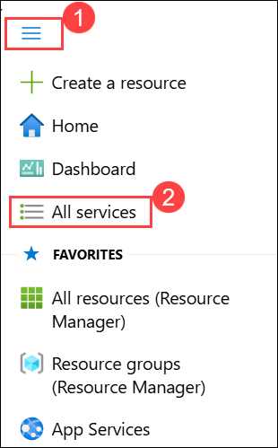

3. 검색 창에 **Azure Migrate (1)** 를 입력하고, 제안 목록에서 **Azure Migrate (2)** 를 선택하여 여십시오.
 
    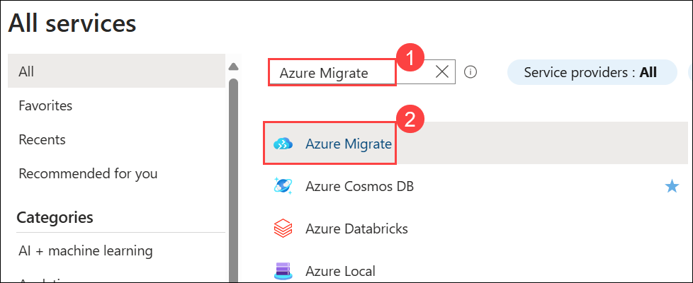

4. **Azure Migrate** 페이지의 왼쪽 탐색 창에서 **All projects (1)** 를 선택한 다음, **SmartHotelMigration<inject key="DeploymentID" enableCopy="false" /> (2)** 를 선택하십시오.
 
    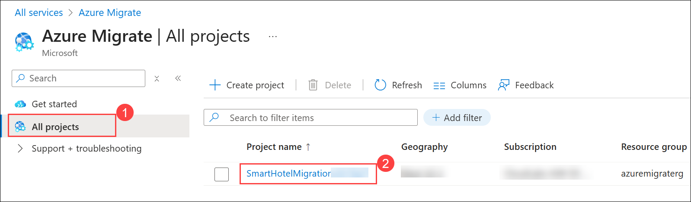

5. **SmartHotelMigration<inject key="DeploymentID" enableCopy="false" />** 페이지에서 **Start discovery (1)** 옆의 드롭다운 화살표를 선택한 다음, **Using appliance (2)** 를 선택하고, **For Azure (3)** 를 선택하십시오.

   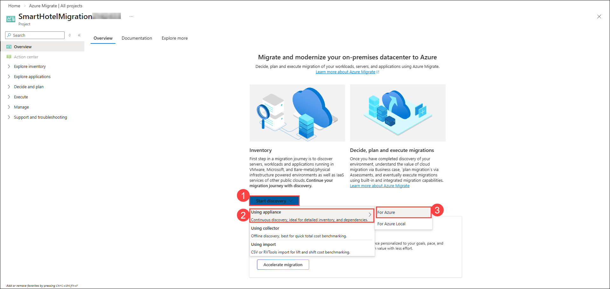
   
6. **Discover** 페이지의 **Are your servers virtualized?** 항목에서 드롭다운 **(1)** 을 클릭하고 목록에서 **Yes, with Hyper-V (2)** 를 선택하십시오.

    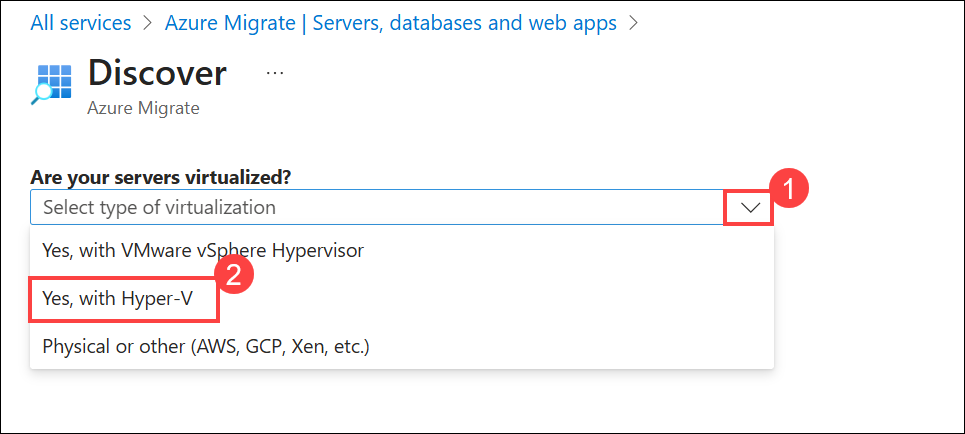

7. **Discover 페이지**의 **1: Generate project key** 항목에서 아래 이름을 어플라이언스 이름 **(1)** 으로 입력한 다음, **Generate key (2)** 를 클릭하여 필요한 Azure 리소스 생성을 시작하십시오.

     ```
     SmartHotelAppl
     ```
    

8. 프로젝트 키가 생성되면, **Project key** 필드 오른쪽의 **copy** 아이콘을 클릭하고 향후 참조를 위해 **Notepad**에 저장하십시오.

    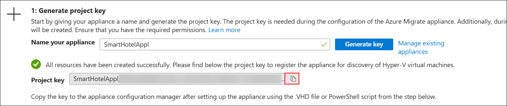

9.  Azure Migrate 어플라이언스를 다운로드, 배포 및 구성하는 방법에 대한 지침을 읽은 다음, 닫기 버튼 **X**를 클릭하여 'Discover machines' 블레이드를 닫으십시오 (.VHD 파일이나 .ZIP 파일은 다운로드하지 **마십시오**. .VHD는 이미 다운로드되어 있습니다). 
 
    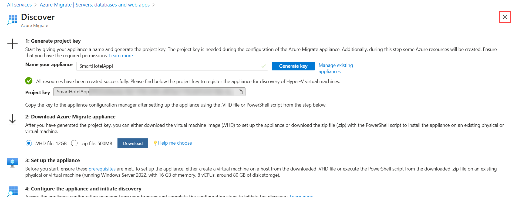

10. Discover and Assessment를 위한 Azure Migrate 프로젝트 키를 생성하였으므로, 다음 작업에서 Hyper-V 관리자에 접속하여 Azure Migrate Appliance를 사용한 검색 프로세스를 시작하게 됩니다.

11. 랩 VM에서 **Start (1)** 버튼을 클릭하고, **Hyper-V Manager (2)** 를 검색한 다음, 결과에서 **Hyper-V Manager (3)** 를 선택하십시오. Hyper-V Manager를 사용하여 인프라에 접근하고 Azure Migrate Appliance VM에 연결하여 검색을 시작하게 됩니다.

    > 작업 표시줄의  아이콘을 클릭하여 Hyper-V Manager를 열 수도 있습니다.

      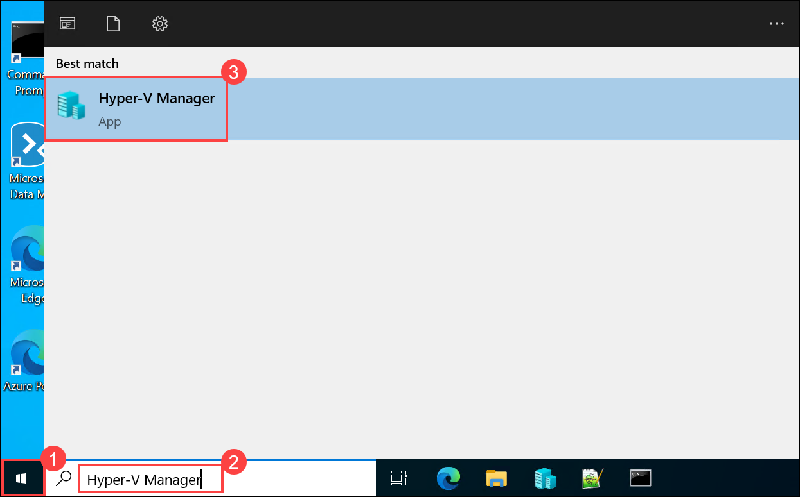

12. Hyper-V Manager의 왼쪽 창에서 **HOSTVMS<inject key="DeploymentID" enableCopy="false" /> (1)** 를 선택하십시오. 이제 AzureMigrateAppliance VM과 함께 온프레미스 SmartHotel 애플리케이션을 구성하는 다른 VM들 **(2)** 이 표시됩니다. 이 VM들은 이후 핸즈온 랩에서 사용됩니다.

    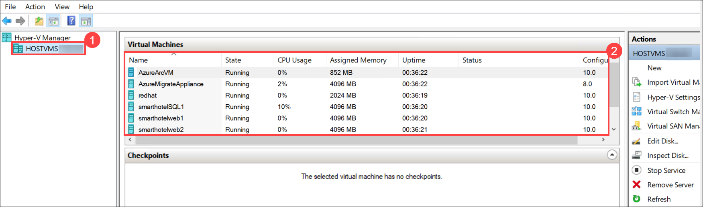
     
13. Hyper-V Manager에서 **AzureMigrateAppliance (1)** VM을 선택한 다음, 아직 실행 중이 아닌 경우 오른쪽 Actions 창에서 **Start (2)** 를 클릭하십시오.

    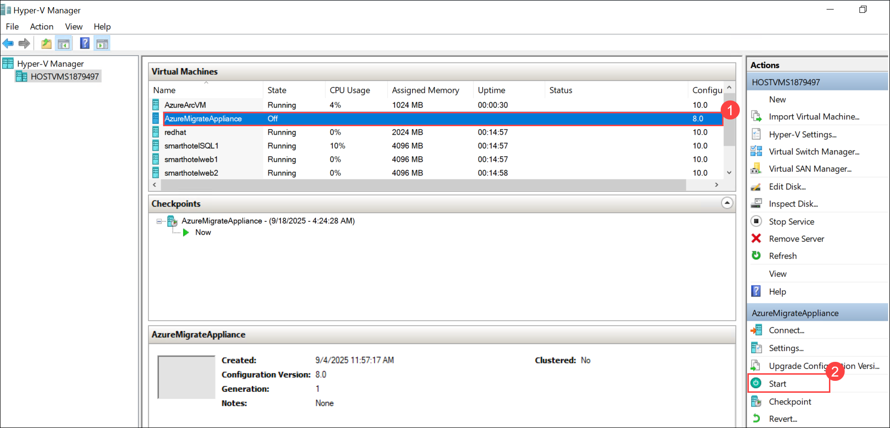
    
     > **참고:** **AzureMigrateAppliance** VM을 시작할 때 오류가 발생하면, **AzureArcVM**을 **끈** 다음, **AzureMigrateAppliance** VM을 다시 시작해 보십시오.

     > **참고:** 아래 단계를 따르고 코드 블록의 명령을 하나씩 실행하십시오.

     1. **Lab VM**에서 **Windows PowerShell** (파란색 아이콘)을 **관리자 권한으로 실행**하십시오.

     2. 아래 코드 블록을 복사하십시오.

     3. PowerShell에 **한 줄씩 붙여넣고** 각 줄 다음에 **Enter**를 누르십시오.

     4. 마지막 줄 이후에 VM **State**가 **Running**으로 표시되는지 확인하십시오.

      ```powershell
    $vm = "AzureMigrateAppliance"
    
    Import-Module Hyper-V -ErrorAction SilentlyContinue
    
    if (-not (Get-Command Get-VM -ErrorAction SilentlyContinue)) { DISM /Online /Enable-Feature /FeatureName:Microsoft-Hyper-V-Management-PowerShell /All }
    
    Import-Module Hyper-V
    
    Remove-VMSavedState -VMName $vm -ErrorAction SilentlyContinue
    
    Stop-VM -Name $vm -TurnOff -ErrorAction SilentlyContinue
    
    Set-VMProcessor -VMName $vm -CompatibilityForMigrationEnabled $true
    
    Set-VMMemory -VMName $vm -DynamicMemoryEnabled $true -StartupBytes 4096MB -MinimumBytes 2048MB -MaximumBytes 8192MB
    
    Start-VM -Name $vm -ErrorAction SilentlyContinue
    
    if ((Get-VM -Name $vm).State -ne 'Running') { Set-VMMemory -VMName $vm -DynamicMemoryEnabled $true -StartupBytes 2048MB -MinimumBytes 1024MB -MaximumBytes 8192MB; Start-VM -Name $vm }
    
    Get-VM -Name $vm | Select Name, State, Status, MemoryAssigned | Format-Table -Auto
    ```
14. Hyper-V Manager에서 **AzureMigrateAppliance (1)** VM을 선택한 다음, 오른쪽 Actions 창에서 **Connect (2)** 를 클릭하십시오.

    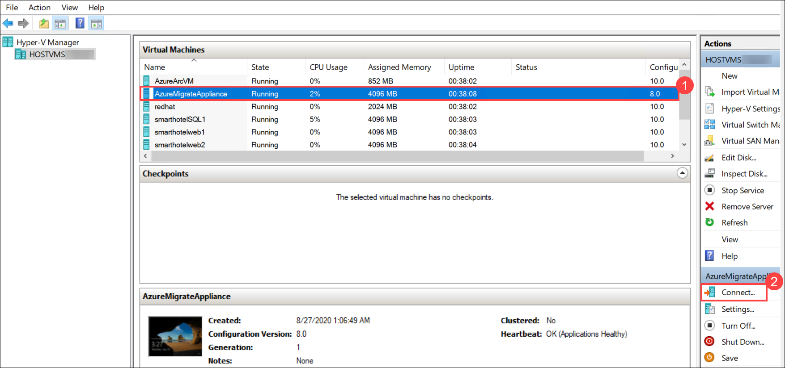    
   
15. **Connect to AzureMigrateAppliance** 창에서 **Connect**를 클릭한 다음, 관리자 비밀번호: **<inject key="SmartHotel Admin Password" />** 를 사용하여 VM에 로그인하십시오. (참고: 로그인 화면에서 로컬 키보드 레이아웃이 사용될 수 있으므로, '눈 모양' 아이콘을 클릭하여 비밀번호가 올바르게 입력되었는지 확인하십시오.)
 
    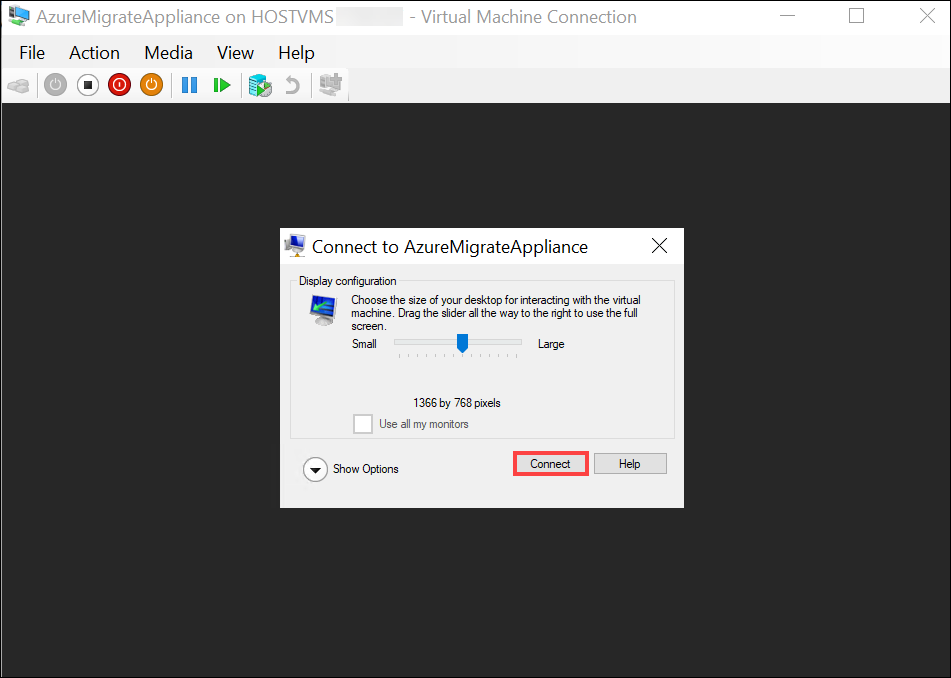

    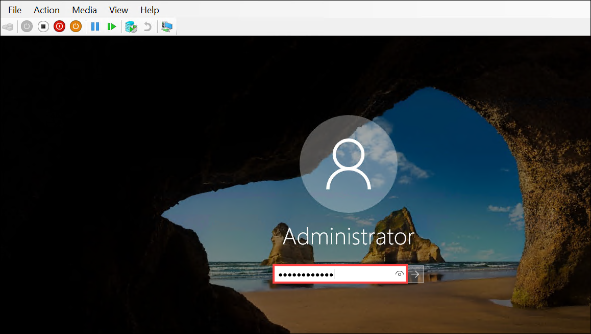

16. **AzureMigrateAppliance** VM의 바탕 화면에서 **Azure Migrate Appliance Configuration Manager** 바로가기를 더블 클릭하여 마법사를 실행하십시오. 브라우저가 열리고 구성 마법사가 표시될 때까지 1~2분 정도 기다려 주십시오.

     > **참고:** New updates available 팝업이 나타나면, View updates를 클릭한 다음 설정 패널을 닫으십시오. 현재로서는 업데이트를 적용하지 않고 진행할 수 있습니다.

    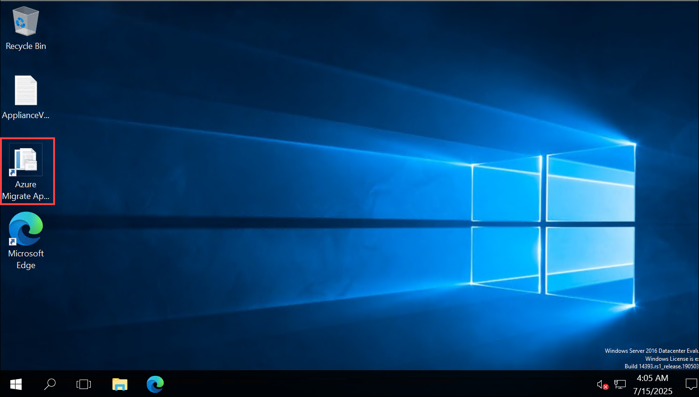
    
    >**참고:** 바탕 화면 바로가기에서 **Azure Migrate appliance configuration wizard**를 실행한 후 자격 증명을 요청하는 프롬프트가 나타나면, [여기](https://github.com/CloudLabsAI-Azure/Know-Before-You-Go/blob/main/AIW-KBYG/AIW-Infrastructure-Migration.md#1-exercise1---task3---step3)의 지침을 따라 어플라이언스 구성 마법사에 연결하십시오.

17. 어플라이언스 구성 마법사에서 **Terms of use** 팝업이 나타나면, 라이선스 약관을 검토하고 **I agree**를 클릭하여 수락하십시오.

    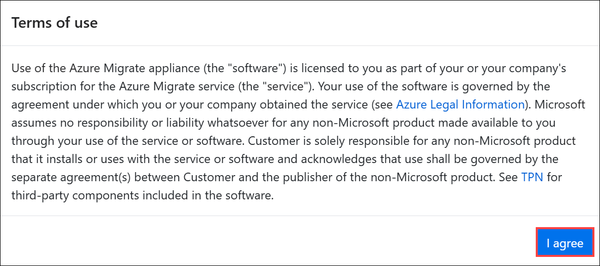

18. **Appliance Configuration Manager Cloud: Public** 페이지의 **Set up prerequisites** 항목에서 다음 두 가지 검사, **Check connectivity to Azure** 및 **Check time is in sync with Azure**가 자동으로 통과되어야 합니다.

    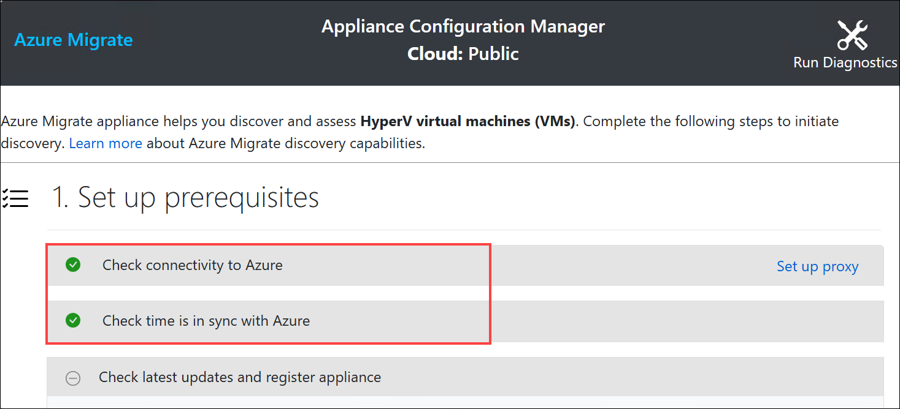

19. **Appliance Configuration Manager Cloud: Public** 페이지의 **1. Set up prerequisites** 항목에서 **Check latest updates and register appliance**를 펼치십시오. 앞서 복사한 **Azure Migrate project key (1)** 를 붙여넣은 다음, **Verify (2)** 를 클릭하여 키를 검증하십시오.

    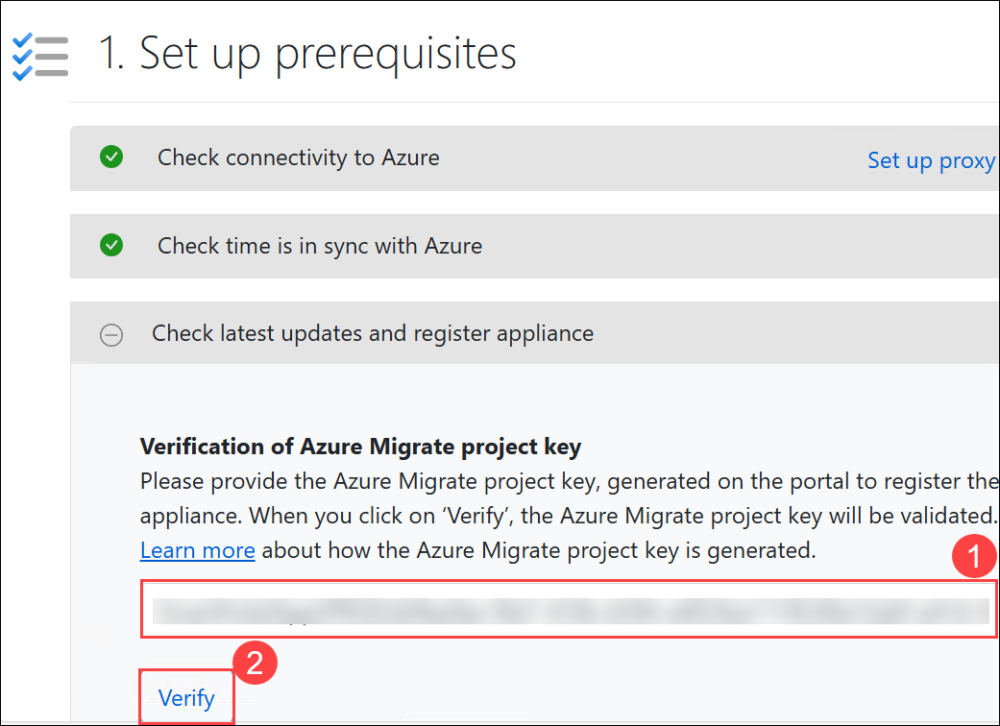

20. 마법사가 최신 Azure Migrate 업데이트를 설치하는 동안 **기다려** 주십시오. 메시지가 표시되면, 사용자 이름으로 **Administrator**, 비밀번호로 **<inject key="SmartHotel Admin Password" />** 를 입력하여 로그인하십시오. 업데이트가 완료되면, **New update installed** 팝업이 나타날 경우 **Refresh**를 클릭하여 어플라이언스 관리 앱을 재시작하십시오.

    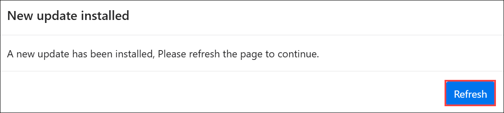

21. **Check latest updates and register appliance** 항목에서 **Appliance auto-update status (1)** 가 성공적으로 완료되었음이 표시될 때까지 기다리십시오. 최대 **5분**이 소요될 수 있습니다. 완료되면, **Login (2)** 을 클릭하여 Azure 자격 증명으로 로그인하십시오.

    
   
    >**참고:** 아래 지침을 따라 로그인 프로세스를 완료하십시오.
    
 1. Login을 클릭한 후, **Continue with Azure Login** 대화 상자에서 **Copy code & Login**을 클릭하여 디바이스 코드를 복사하십시오.
    
    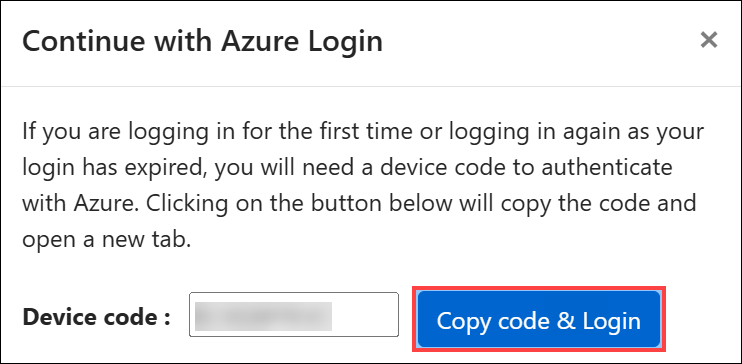
  
 1. 새 브라우저 탭에 Azure 로그인 프롬프트가 열립니다. 표시되지 않으면, 브라우저의 팝업 차단기가 비활성화되어 있는지 확인하십시오. 디바이스 **code (1)** 를 붙여넣고 **Next (2)** 를 클릭하십시오. 그런 다음 Azure portal 자격 증명으로 로그인하라는 메시지가 표시됩니다.

     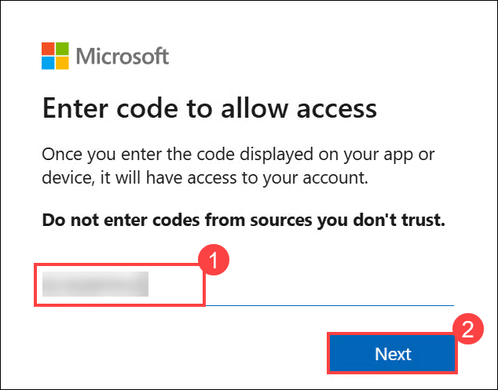

 1. 제공된 Azure 자격 증명을 사용하여 로그인하십시오. 
    
     - Azure Username/Email: <inject key="AzureAdUserEmail"></inject>
        
        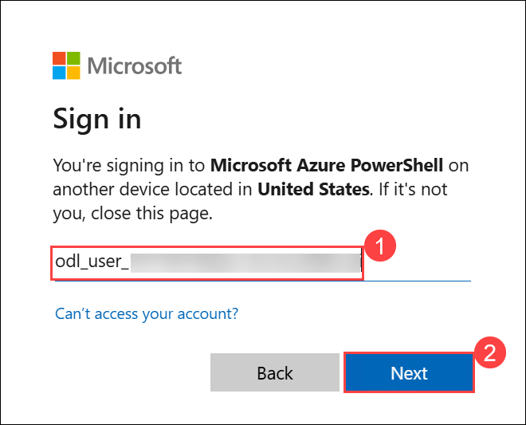
       
     - Azure Password: <inject key="AzureAdUserPassword"></inject>
   
        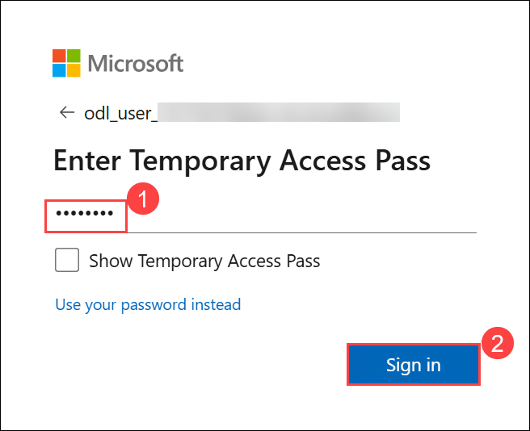
   
     - **Are you trying to sign in to Microsoft Azure PowerShell?** 프롬프트에서 **Continue**를 선택하여 로그인을 완료하십시오. 

        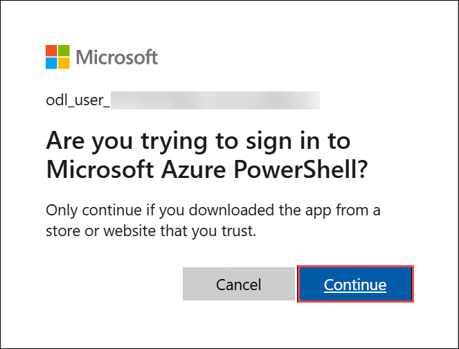
    
1. 로그인이 완료되면, Azure Migrate Appliance 탭으로 돌아가십시오. 어플라이언스 등록이 자동으로 시작되며, 완료되면 The appliance has been successfully registered가 표시됩니다.

   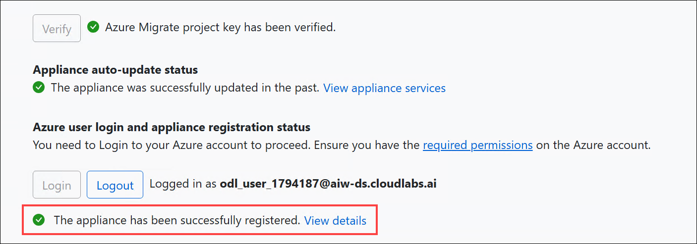

    > **참고**: 로그인 프로세스에는 5분에서 10분 정도 소요될 수 있습니다.
    
1. 등록이 완료되면, **Manage credentials and discovery sources** 패널로 이동하십시오. **Step 1: Provide Hyper-V host credentials for discovery of Hyper-V VMs** 항목에서 **Add credentials**를 클릭하여 진행하십시오.

    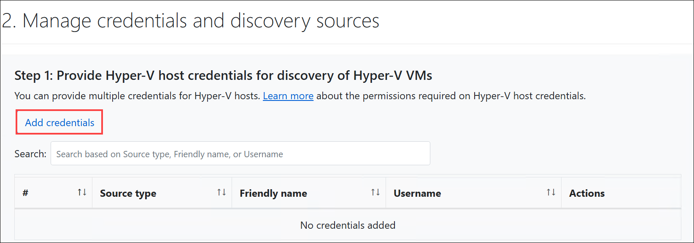

1. **Add credentials** 탭에서 어플라이언스가 VM을 검색하는 데 사용할 Hyper-V 호스트/클러스터에 대한 다음 세부 정보를 입력한 다음, **Save (4)** 를 클릭하여 계속 진행하십시오.
 
      - Friendly name: **hostlogin (1)** 을 입력하십시오
      - Username: **<inject key="SmartHotelHost Admin Username" /> (2)**
      - Password: **<inject key="SmartHotelHost Admin Password" /> (3)**

        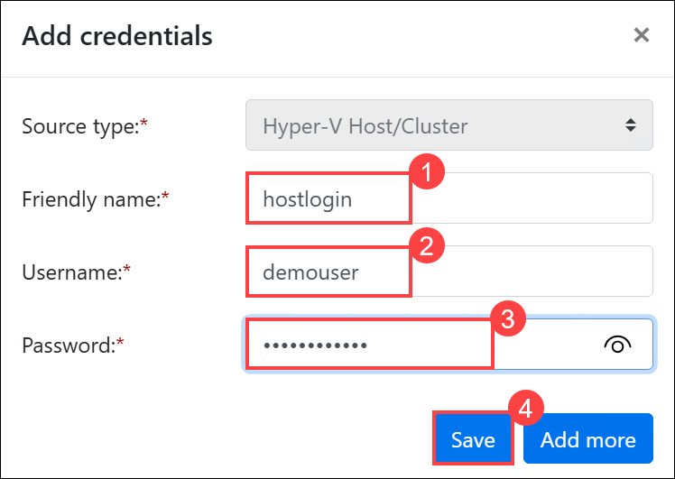

        > **참고**: Azure Migrate 어플라이언스가 로컬 키보드 매핑을 인식하지 못할 수 있습니다. 비밀번호 입력란의 '눈 모양' 아이콘을 선택하여 비밀번호가 올바르게 입력되었는지 확인하십시오.

1. **Step 2: Provide Hyper-V host/cluster details** 항목에서 **Add discovery source**를 클릭하여 Hyper-V 호스트/클러스터의 IP 주소 또는 FQDN을 지정하십시오.
   
    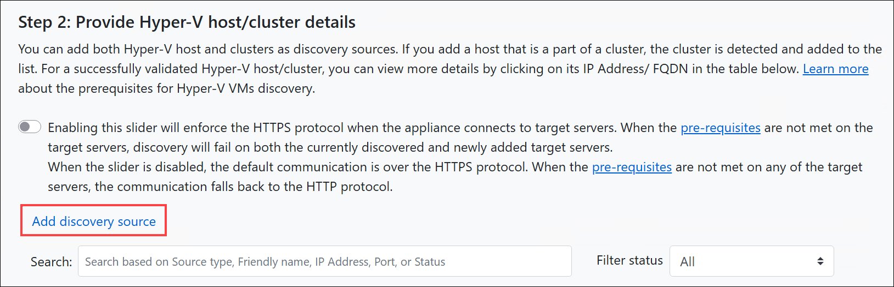

1. **Add discovery source** 블레이드에서 다음 세부 정보를 입력하십시오:
     
      - **Add single item (1)** 을 선택하십시오
      - IP Address / FQDN: **HOSTVMS<inject key="DeploymentID" enableCopy="false" /> (2)** 를 입력하십시오
      - Map credentials: 드롭다운에서 **hostlogin (3)** 을 선택하십시오
      - **Save (4)** 를 선택하십시오.

        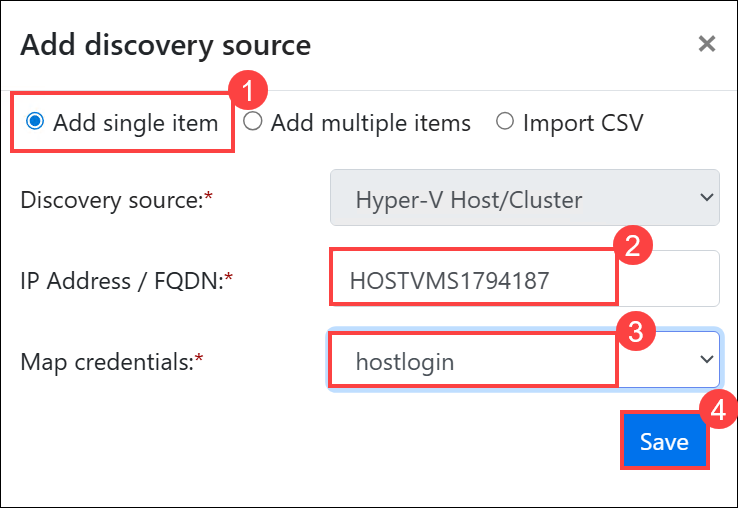

         > **참고:** **Add single item**으로 한 번에 하나씩 추가하거나 **Add multiple items**로 한꺼번에 여러 개를 추가할 수 있습니다. **Import CSV**를 통해 Hyper-V 호스트/클러스터 세부 정보를 제공하는 옵션도 있습니다.

1. 검색 소스가 추가되면, 어플라이언스가 Hyper-V 호스트/클러스터에 대한 연결을 검증합니다. 해당 호스트 또는 클러스터 옆의 테이블에 **Validation successful** 상태가 표시됩니다.

    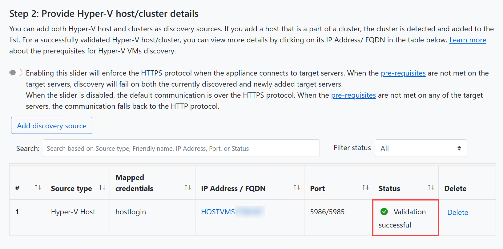

    > **참고:** 검색 소스를 추가할 때:
    > - 검증에 성공한 호스트/클러스터의 경우, IP 주소/FQDN을 선택하여 자세한 정보를 확인할 수 있습니다.
    > - 호스트에 대한 검증이 실패하면, 테이블의 Status 열에서 Validation failed를 선택하여 오류를 검토하십시오. 문제를 수정하고 다시 검증하십시오.
    > - 호스트 또는 클러스터를 제거하려면 **Delete**를 선택하십시오.
    > - 클러스터에서 특정 호스트만 제거할 수는 없습니다. 전체 클러스터만 제거할 수 있습니다.
    > - 클러스터 내 특정 호스트에 문제가 있더라도 클러스터를 추가할 수 있습니다.

1. **Step 3: Provide server credentials to perform guest discovery of installed software, dependencies and workloads** 항목에서 슬라이더를 **Disable**로 설정한 다음, **Start discovery**를 선택하여 검증된 Hyper-V 호스트 또는 클러스터에서 VM 검색을 시작하십시오.

   >**참고:** 검색 프로세스가 완료되기까지 최대 10분이 소요될 수 있습니다.
   
   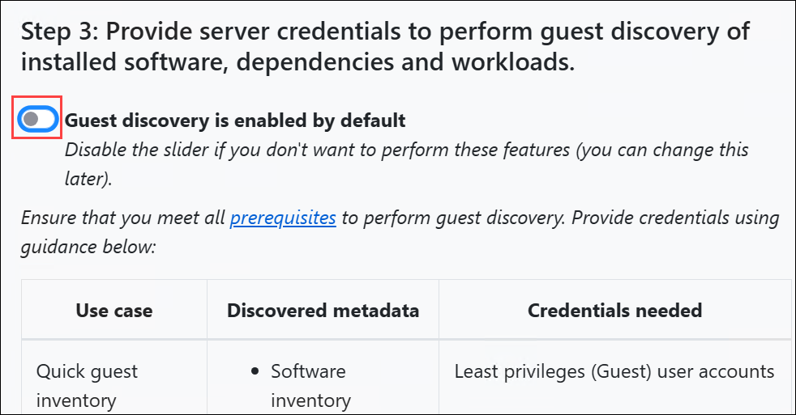
    
   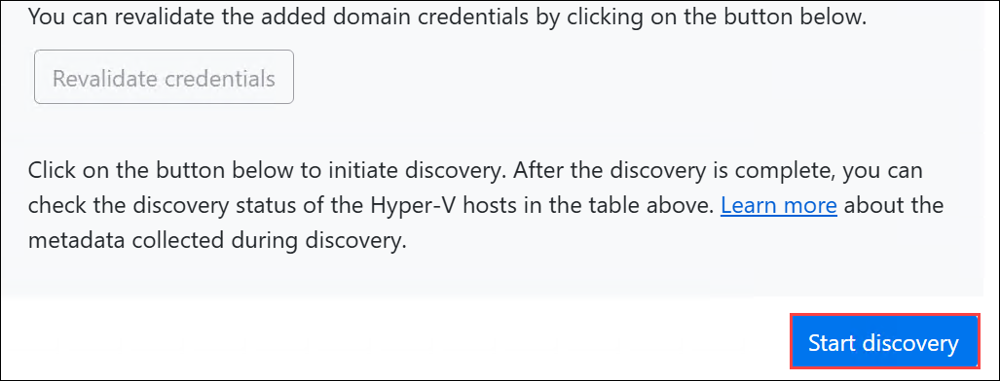

1. Azure Migrate 상태가 **Discovery has been successfully initiated**로 표시될 때까지 기다리십시오. 이 과정은 몇 분 정도 소요됩니다. 검색이 성공적으로 시작된 후에는 테이블에서 각 호스트/클러스터별 검색 상태를 확인할 수 있습니다.
  
    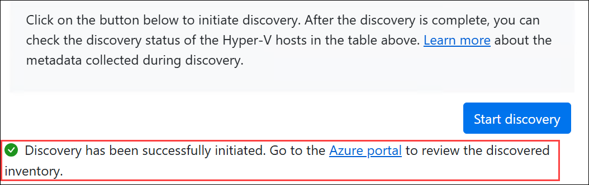


### 요약 

이 실습에서는 Azure Migrate 프로젝트와 서버 평가 및 서버 마이그레이션을 위한 기본 제공 도구를 살펴보았습니다. 또한 온프레미스 Hyper-V 환경에서 Azure Migrate 어플라이언스를 구성하고, Azure Migrate를 사용하여 마이그레이션 평가 검색 프로세스를 시작하였습니다.

오른쪽 하단의 **Next >>** 를 클릭하여 다음 페이지로 이동하십시오.

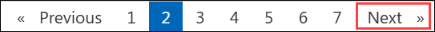
