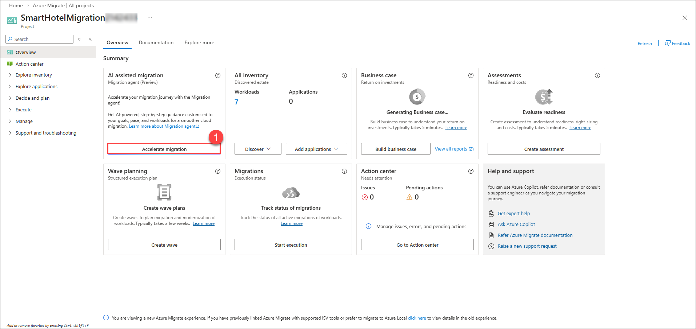
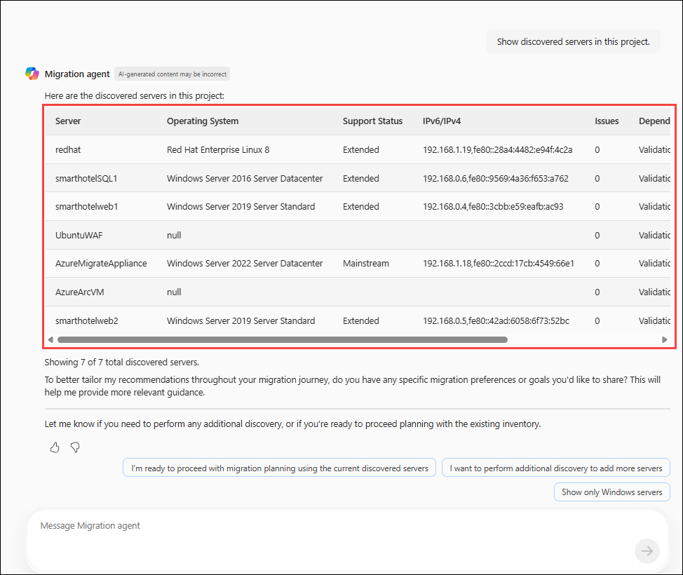
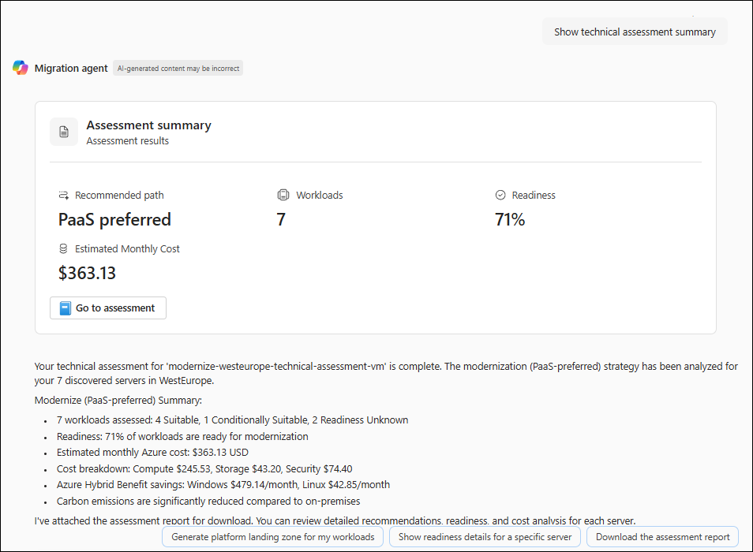
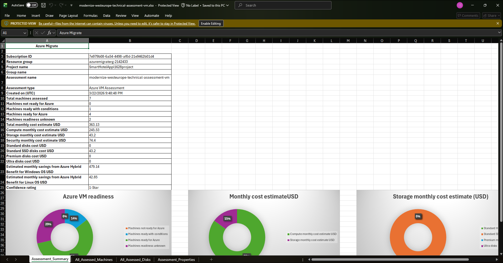
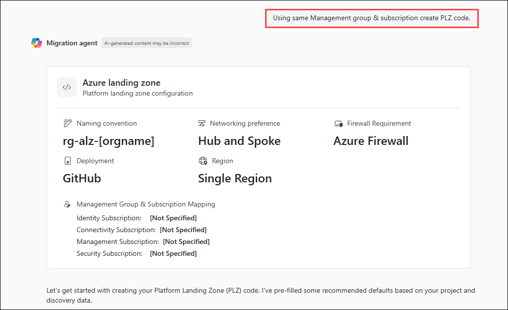
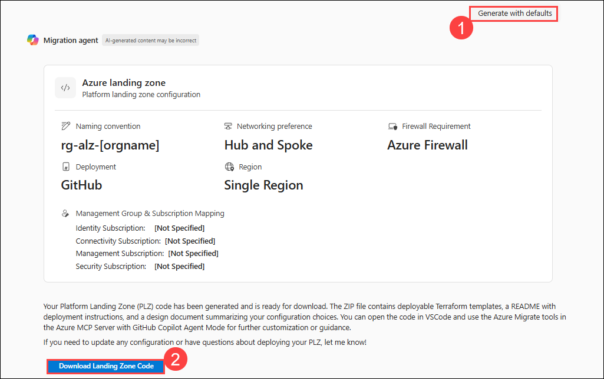
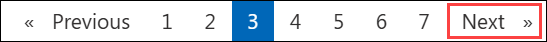

# 연습 2: 비즈니스 가치 및 ROI 정당성 평가

### 예상 소요 시간: 40분

이 연습에서는 Azure Migrate와 Copilot 프롬프트를 사용하여 SmartHotel 애플리케이션의 마이그레이션 준비 상태를 평가합니다. 먼저 VM에 대한 평가를 생성하고, VM을 설정 및 그룹화하여 Azure로의 마이그레이션 준비 여부를 보여주는 보고서를 생성합니다.

다음으로, 모니터링 에이전트를 VM에 설치하여 종속성 시각화를 구성합니다. 이를 통해 서로 다른 애플리케이션 구성 요소 간의 종속성을 매핑하고 이해할 수 있으며, Azure로 마이그레이션하기 전에 모든 것이 올바르게 작동하는지 확인할 수 있습니다.

## 실습 목표

이 연습에서는 다음 작업을 완료합니다:

- 작업 1: Azure Copilot을 사용하여 마이그레이션 평가 생성

### 작업 1: Azure Copilot을 사용하여 마이그레이션 평가 생성

이 작업에서는 Azure Copilot을 사용하여 검색 단계에서 수집된 데이터를 활용하여 SmartHotel 애플리케이션에 대한 마이그레이션 평가를 생성합니다.

1. **LabVM**으로 돌아간 후 Azure Portal에서 **Azure Migrate** 페이지로 이동합니다. 왼쪽 탐색 창에서 **All projects**를 선택한 다음 **SmartHotelMigration<inject key="DeploymentID" enableCopy="false" />**을 선택합니다. 그런 다음 **Accelerate migration (1)**을 클릭하여 이전 환경에서 세부 정보를 확인합니다.

    

2. 프롬프트에 **Show discovered servers in this project**를 입력합니다.

    

3. 프롬프트에 **Create a business case summary**를 입력합니다. 검색된 서버에 대한 ROI를 분석하기 위한 Business Case가 생성됩니다.

    

4. 프롬프트에 **Show the business case summary**를 입력합니다. 검색된 인프라에 대한 상세 Business Case 요약, ROI, 예상 비용이 표시됩니다. 아래로 스크롤하여 세부 내용을 확인하시기 바랍니다.

    
    
5. 프롬프트에 **Create technical assessment summary**를 입력합니다.

    

6. 프롬프트에 **Show technical assessment summary**를 입력합니다.

    
    
    
7. 프롬프트에 **Using same Management group & subscription create PLZ code.**를 입력하고 Copilot의 응답을 검토합니다.

    

8. 프롬프트에 **Generate with defaults (1)**를 입력하고, **Download Landing Zone Code (2)**를 클릭하여 파일을 다운로드합니다.

    

### 요약

이 연습에서는 Azure Migrate에서 마이그레이션 평가를 생성 및 구성하고, Log Analytics 작업 영역을 만들어 Windows 및 Linux 온프레미스 머신에 Azure Monitoring Agent 및 Dependency Agent를 배포하여 종속성 시각화 기능을 구성했습니다.

오른쪽 하단의 **Next**를 클릭하여 다음 페이지로 이동합니다.

