# 실습 4: GitHub Copilot을 활용한 애플리케이션 모더나이제이션

### 예상 소요 시간: 90분

## 개요

이 실습에서는 GitHub Copilot과 GitHub Copilot modernization 확장을 사용하여 레거시 SmartHotel 애플리케이션을 모더나이즈합니다. 이 애플리케이션은 오래된 디자인 패턴을 기반으로 하며 클라우드 배포에 적합하지 않습니다. 애플리케이션을 GitHub에 업로드하고, Copilot 에이전트를 사용하여 분석한 다음, modernization 확장을 사용하여 코드를 리팩터링하고 클라우드 지원 구성을 생성합니다. 마지막으로, 애플리케이션을 컨테이너화하고 Azure 배포를 준비합니다. 이 실습에서는 AI 기반 도구가 애플리케이션 모더나이제이션을 어떻게 간소화하고 가속화할 수 있는지 보여드립니다.

## 실습 목표

이 실습에서는 다음 작업을 완료하게 됩니다:

- 작업 1: GitHub 리포지토리 생성 및 구성
- 작업 2: 애플리케이션 코드를 GitHub에 업로드
- 작업 3: GitHub Copilot Agent를 사용하여 애플리케이션 분석
- 작업 4: Visual Studio Code에서 GitHub Copilot 구성
- 작업 5: GitHub Copilot을 사용하여 애플리케이션 모더나이즈

## 작업 1: GitHub 리포지토리 생성 및 구성

이 작업에서는 GitHub에 로그인하고, 새 리포지토리를 생성하며, SmartHotel 애플리케이션 코드를 호스팅할 수 있도록 준비합니다.

1. LABVM 데스크톱에서 **Microsoft Edge** 브라우저를 엽니다.

   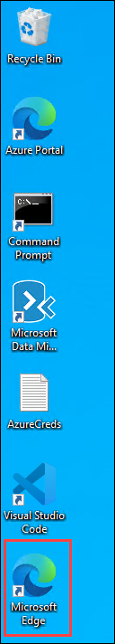

1. 아래 URL을 복사하여 브라우저 주소 표시줄에 붙여넣어 **GitHub 로그인** 페이지를 엽니다:

   ```
   https://github.com/login
   ```

1. **Sign in to GitHub** 탭에서 제공된 **GitHub 사용자 이름** **(1)** 을 입력 필드에 입력하고, **Sign in with your identity provider** 를 클릭하여 계속 진행합니다 **(2)**.

    - **Username:** <inject key="GitHub User Name" enableCopy="true"/>

      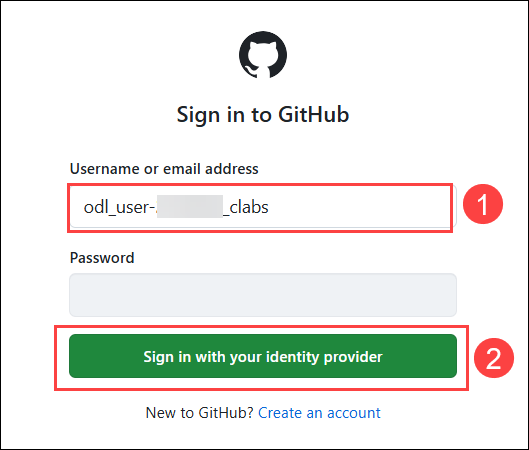

1. **Single sign-on to CloudLabs Organizations** 페이지에서 **Continue** 를 클릭하여 진행합니다.

   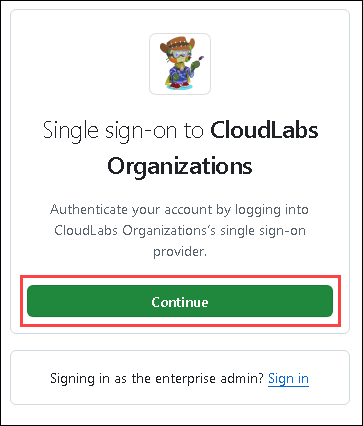

1. **Sign in** 페이지에서 다음 자격 증명을 입력하고 **Sign in** 을 선택합니다. GitHub 관리 페이지로 로그인됩니다.

   - **Email/Username: (1)** <inject key="AzureAdUserEmail"></inject>

   - **Temporary Access Pass: (1)** <inject key="AzureAdUserPassword"></inject>

     >**참고:** Stay Signed in? 팝업이 나타나면 Yes를 선택하십시오.

1. 이제 **GitHub**에 성공적으로 로그인되었으며 **GitHub 홈페이지**로 리디렉션되었습니다. **Create repository**를 클릭합니다.

   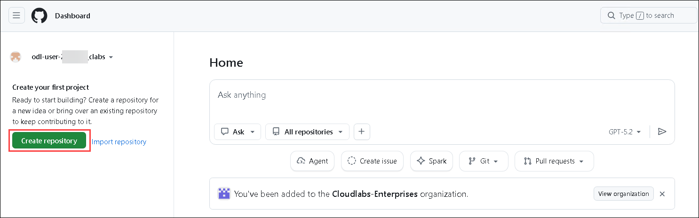

1. **Create a new repository** 페이지에서 리포지토리 이름으로 **smarthotel (1)** 을 입력하고, 소유자로 **Cloudlabs-Enterprise (2)** 를 선택합니다. **Create repository (3)** 를 클릭합니다.

   

   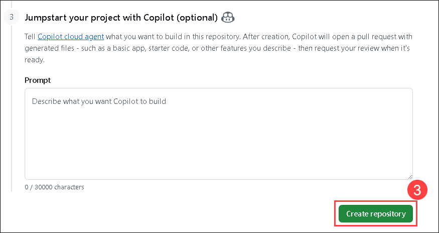

1. 잠시 후 새로 생성된 리포지토리의 홈 페이지로 이동됩니다. 리포지토리 URL을 복사하여 메모장에 붙여넣습니다.

   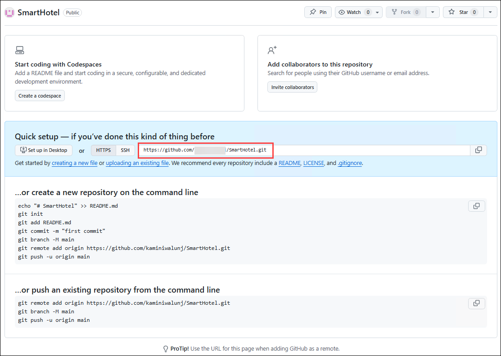

## 작업 2: 애플리케이션 코드를 GitHub에 업로드

이 작업에서는 Visual Studio Code에서 SmartHotel 프로젝트를 열고, Git 리포지토리를 초기화하며, 기존 애플리케이션 코드를 GitHub에 푸시합니다.

1. LabVM 데스크톱에서 **Visual Studio Code** 아이콘을 클릭하여 엽니다.

   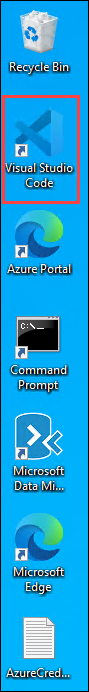

1. Visual Studio Code에서 **Explorer (1)** 로 이동한 다음 **Open Folder (2)** 를 클릭합니다. 팝업 창에서 SmartHotel 애플리케이션 소스 코드 디렉터리인 `C:\Projects` **(1)** 로 이동하여 **SmartHotel (1)** 폴더를 선택합니다. 선택한 후 **Select Folder (3)** 를 클릭합니다.

   

   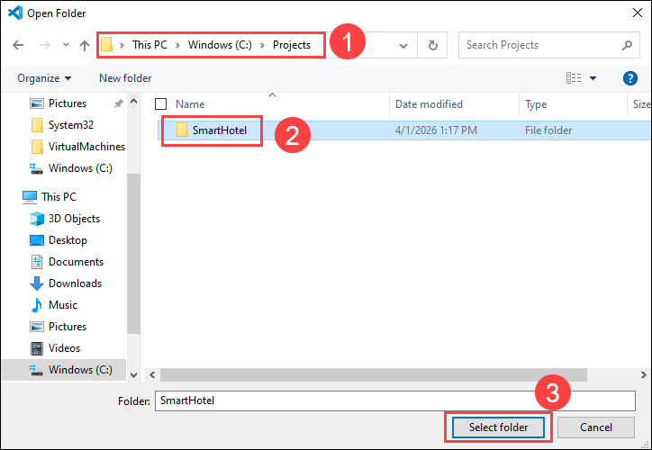

   >**참고:** ***Do you trust the authors of the files in this folder?*** 팝업이 나타나면 ***Yes, I trust the authors***를 선택하십시오.

1. 왼쪽의 **Explorer** 패널에서 폴더 구조를 확장하여 애플리케이션 레이아웃을 검토합니다. 레거시 구성 파일, 하드코딩된 값 및 전체 프로젝트 구조를 확인합니다.

   

1. **Terminal (1)** 옵션으로 이동하여 **New terminal (2)** 을 클릭하고 다음 명령을 실행하여 애플리케이션 디렉터리로 이동합니다.

   ```bash
   cd C:\Projects\SmartHotel
   ```

    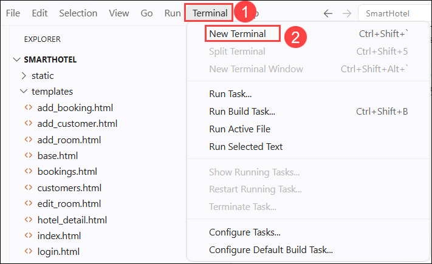

1. 아래 명령을 실행하여 Git 리포지토리를 초기화하고 모든 프로젝트 파일을 추가합니다.

    ```bash
    git init
    git add .
    ```

1. 다음 명령을 실행하여 변경 사항을 커밋하고 메인 브랜치를 설정합니다.

    ```bash
    git commit -m "Initial commit"
    git branch -M main
    ```

1. 다음 명령을 실행하여 GitHub 리포지토리에 연결합니다. `<repository-url>`을 작업 1의 8단계에서 복사한 GitHub 리포지토리 링크로 교체하십시오.

    ```bash
    git remote add origin <repository-url>
    ```
      >**참고:** 로그인 팝업이 나타나면 **Sign in with your browser**를 클릭하십시오. 브라우저 창이 열리면 Git Credential 인증을 위해 **Autorise git-ecosystem**을 선택하십시오.

      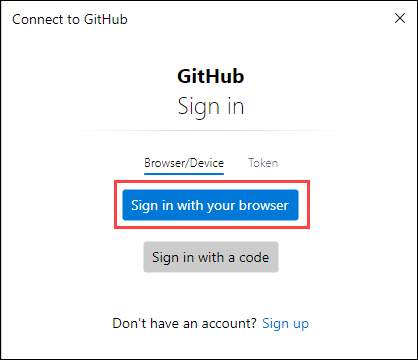

      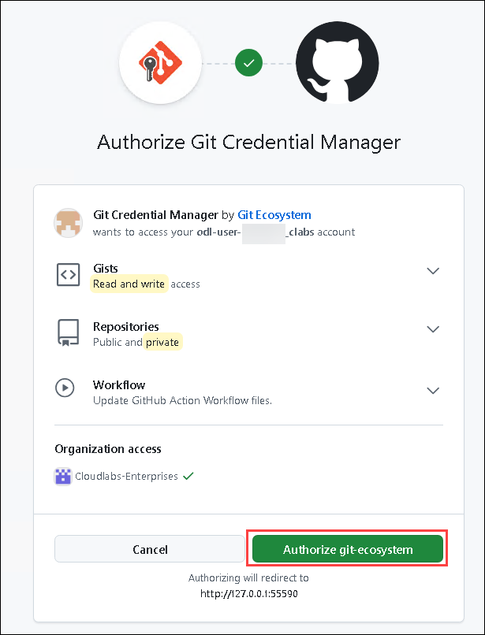

1. 다음 명령을 실행하여 코드를 GitHub에 푸시합니다.

    ```bash
    git push -u origin main
    ```
      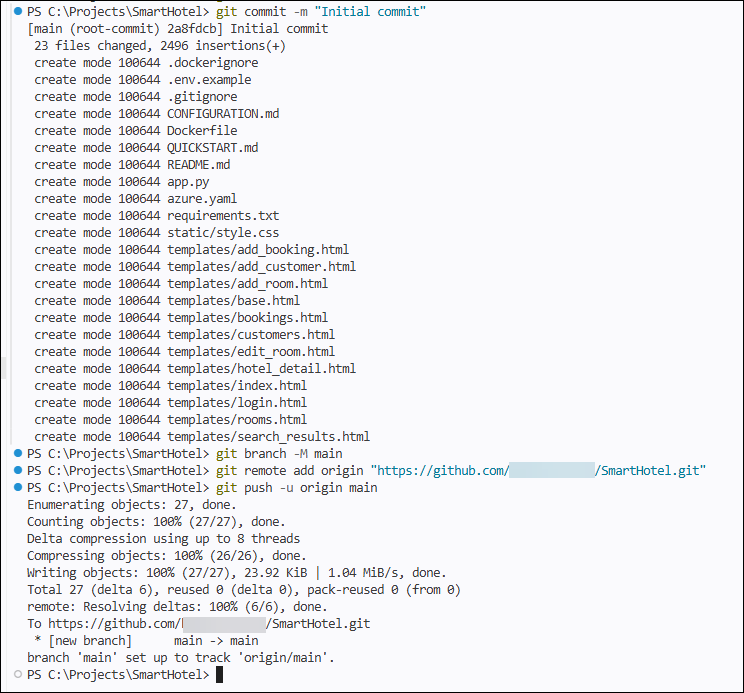

### 작업 3: GitHub Copilot Agent를 사용하여 애플리케이션 분석

이 작업에서는 GitHub Copilot의 에이전트 기능을 사용하여 리포지토리를 분석하고, 애플리케이션 평가 보고서를 생성하며, 모더나이제이션 인사이트가 포함된 Pull Request를 생성합니다.

1. GitHub 리포지토리로 돌아갑니다. **Agents (1)** 를 클릭하고 다음 프롬프트 **(2)** 를 입력한 후 Enter를 누릅니다 **(3)**.

   ```bash
   Analyze this repository and generate an application assessment report and architecture diagram for modernization. Also create a pull request with the generated files.
   ```

   

1. 새 세션이 생성되고 Agent가 모더나이제이션 인사이트를 생성하기 위해 애플리케이션 분석을 시작합니다. 프로세스가 완료될 때까지 기다립니다.

   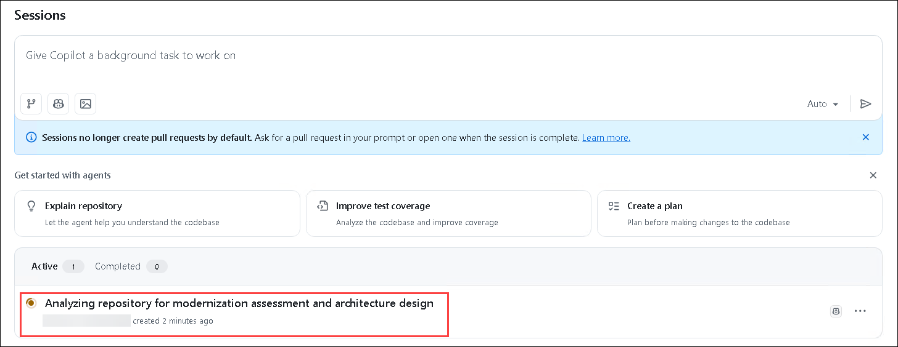

1. 분석이 완료되면 출력을 검토합니다. Agent는 애플리케이션 평가 보고서, 아키텍처 다이어그램 및 Pull Request를 생성해야 합니다.

   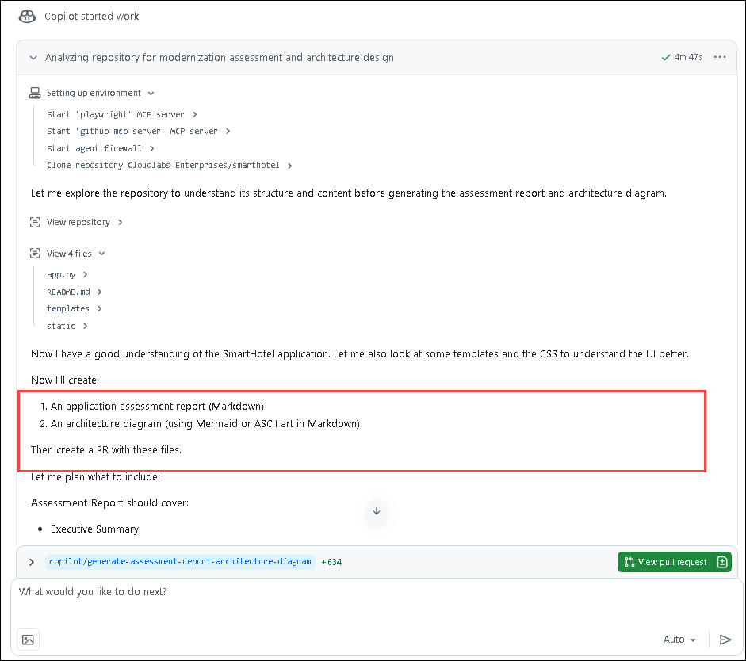

4. 변경 사항을 검토하려면 **View pull request**를 클릭합니다. Pull Request의 **Conversation** 탭에서 **Summary**를 통해 제안된 변경 사항을 검토합니다.

   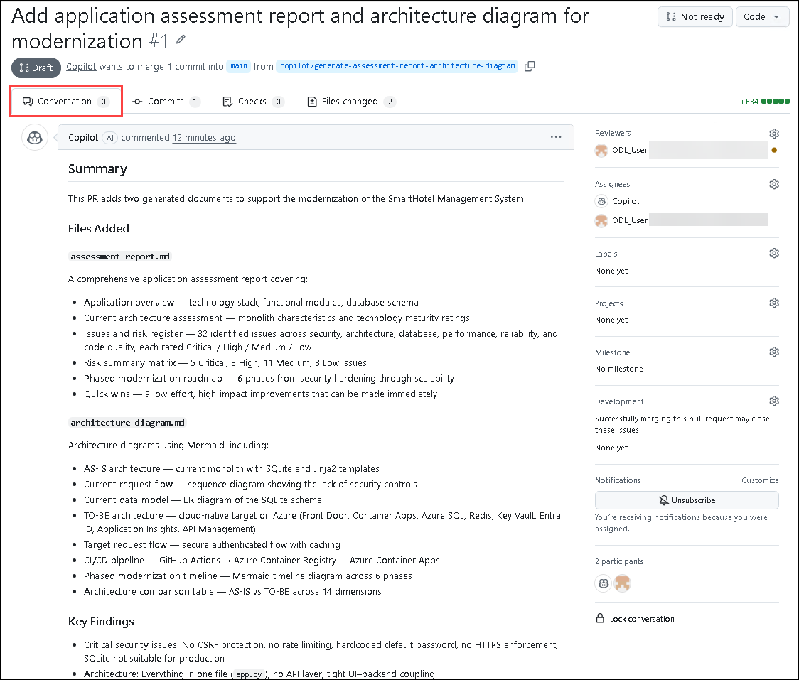

5. Pull Request가 현재 Draft 상태인 경우, 병합을 진행하기 전에 **Ready for review**를 클릭합니다.

   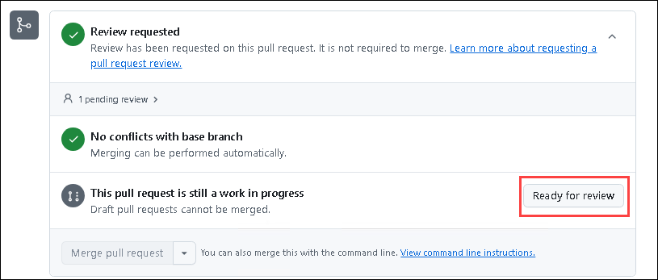

6. 그런 다음 **Merge pull request**를 선택하고, 커밋 메시지를 검토한 후 **Commit merge**를 클릭합니다.

   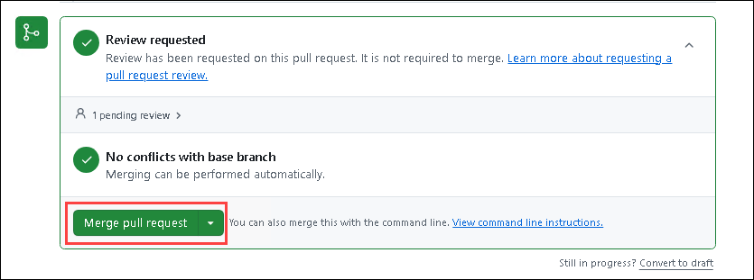

   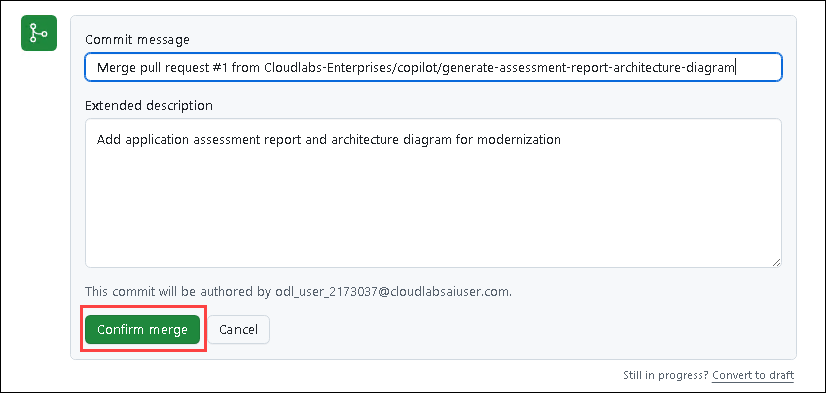
   
1. Visual Studio Code로 돌아가서 **Terminal (1)** 옵션으로 이동하고 **New terminal (2)** 을 클릭한 후 다음 명령을 실행하여 변경 사항을 로컬 환경에 동기화합니다.

   ```bash
   git pull origin main
   ```
   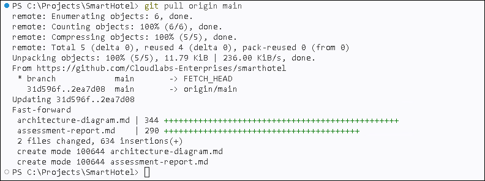

1. 새 파일이 로컬에 제대로 있는지 확인합니다.

   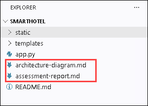


## 작업 4: Visual Studio Code에서 GitHub Copilot 구성

이 작업에서는 Visual Studio Code에서 GitHub Copilot 확장을 설치하고 로그인하여 AI 기반 개발 기능을 활성화합니다.

1. Visual Studio Code에서 왼쪽 사이드바의 **Extensions** 아이콘 **(1)** 을 클릭하고(또는 `Ctrl+Shift+X` 를 누름), 검색 상자에 **GitHub Copilot Chat** **(2)** 을 입력한 다음 **GitHub Copilot chat** 확장에서 **Install (3)** 을 클릭합니다.

   

1. Extensions에서 **GitHub Copilot (1)** 을 검색하고, 목록에서 **GitHub Copilot modernization (2)** 을 선택한 다음 **Install (3)** 을 클릭합니다.

   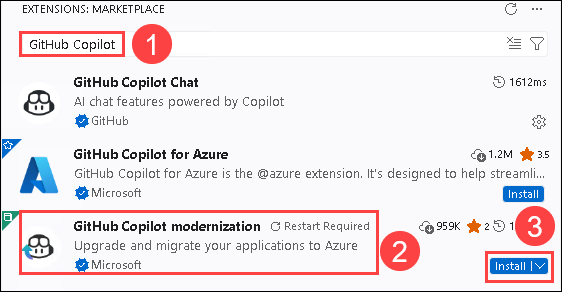

1. 오른쪽 하단 모서리의 **Signed out (1)** 아이콘을 클릭하고 **Sign in to Use AI Features (2)** 를 클릭합니다. 그런 다음 **Continue with GitHub (3)** 를 클릭합니다.

   

   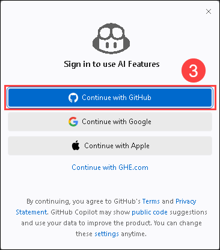

1. 브라우저가 다시 열리며 사용할 GitHub 계정을 선택하라는 메시지가 표시됩니다. **Continue (1)** 를 클릭하고 팝업 창에서 **Open (2)** 을 클릭합니다.

   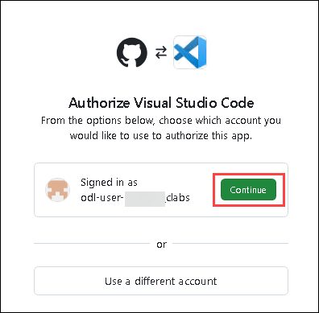

   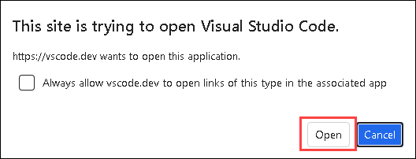

1. 로그인이 성공적으로 완료되었는지 확인합니다.

   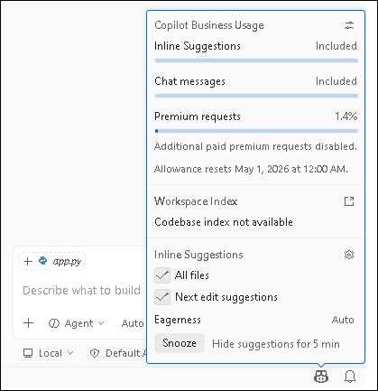

## 작업 5: GitHub Copilot을 사용하여 애플리케이션 모더나이즈

이 작업에서는 Copilot modernization 에이전트를 사용하여 애플리케이션을 리팩터링하고, 구성 및 배포 파일을 생성하며, Pull Request를 통해 모더나이제이션 워크플로를 완료합니다.

1. **`Ctrl + Alt + I`** 를 눌러 GitHub Copilot Chat 패널을 엽니다. 그런 다음 **`@modernize` (1)** 를 입력하고 **Enter** 를 눌러 Modernization Agent를 시작합니다.

   

1. GitHub Copilot이 모더나이제이션 목표를 선택하라는 메시지를 표시합니다. **Azure migration for this Python app (1)** 을 선택합니다. **Submit (2)** 을 클릭합니다. 이 옵션은 구성, 종속성 및 아키텍처를 업데이트하여 애플리케이션을 Azure 배포에 맞게 준비합니다.

   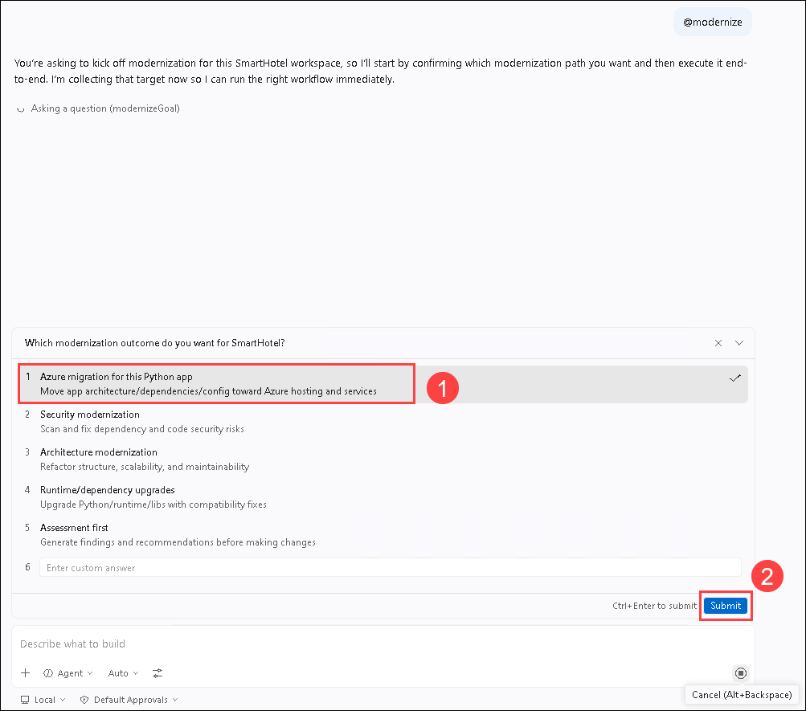

1. 모더나이제이션 요청을 제출한 후 GitHub Copilot이 처리를 완료할 때까지 기다립니다. 명령 실행을 요청하는 팝업이 나타나면 **Allow**를 클릭합니다.

1. Copilot Chat 창에서 제안된 변경 사항을 검토합니다. 다양한 업데이트 제안이 포함될 수 있습니다. Copilot이 권장하는 변경 사항을 수락하려면 **Keep**을 클릭합니다.

   - 애플리케이션 업데이트 (예: app.py)
   - 새 구성 파일 (requirements.txt, .env.example)
   - 배포 파일 (azure-deploy.yml)
   - 인프라 파일 (main.bicep, parameters.json)
   - 문서 업데이트 (README.md)

      

1. **Explorer (1)** 탭으로 이동하여 새 브랜치가 생성되고 변경 사항이 성공적으로 커밋되었는지 확인합니다. **브랜치 이름 (2)** 을 메모장에 기록합니다.

      

1. **Terminal (1)** 을 열고 **New terminal (2)** 을 클릭합니다.
 
    

1. 다음 명령을 실행하여 새로 생성된 브랜치를 GitHub에 푸시합니다:

   ```bash
   git push origin <branch-name>
   ```
   >**참고:** 이 예시에서 브랜치 이름은 `appmod/python-migration-20260408161023`입니다. 타임스탬프는 다를 수 있으므로(형식: `appmod/python-migration-'timestamp'`), 적절한 브랜치 이름을 사용하십시오.

   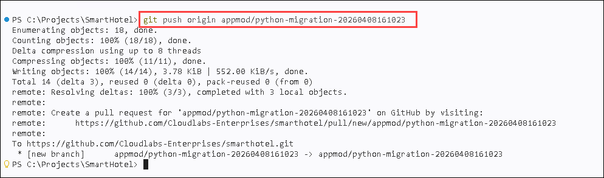

1. 푸시가 완료되면 브라우저에서 GitHub 리포지토리를 엽니다. Pull Request를 생성하라는 알림이 표시됩니다. **Compare & pull request (1)** 를 클릭합니다.

   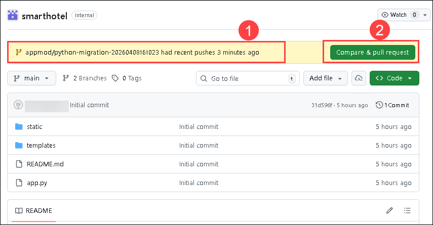

1. Open a pull request 페이지에서 아래로 스크롤하여 변경 사항을 검토합니다. **`>`** 아이콘을 클릭하여 파일을 확장하고 변경된 내용을 확인합니다.

   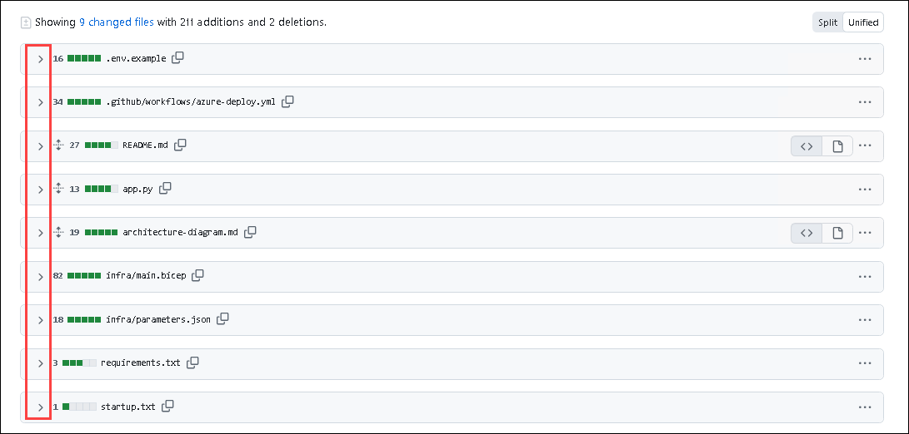

1. 검토가 완료되면 위로 스크롤하여 **Create pull request**를 클릭합니다.

   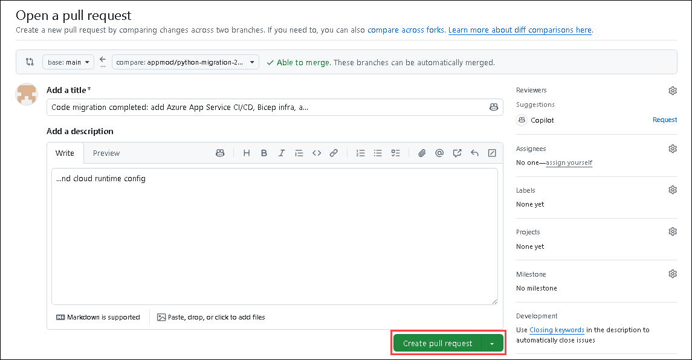

1. Pull Request가 생성되면 **Merge pull request**를 클릭한 다음 **Confirm merge**를 선택합니다. 이 단계는 Copilot이 생성한 변경 사항을 메인 브랜치에 병합하여 모더나이제이션 워크플로를 완료합니다.

   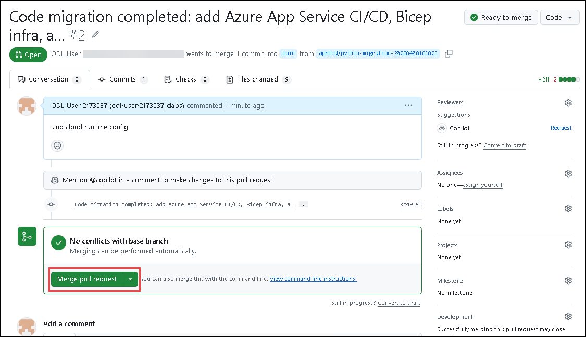

   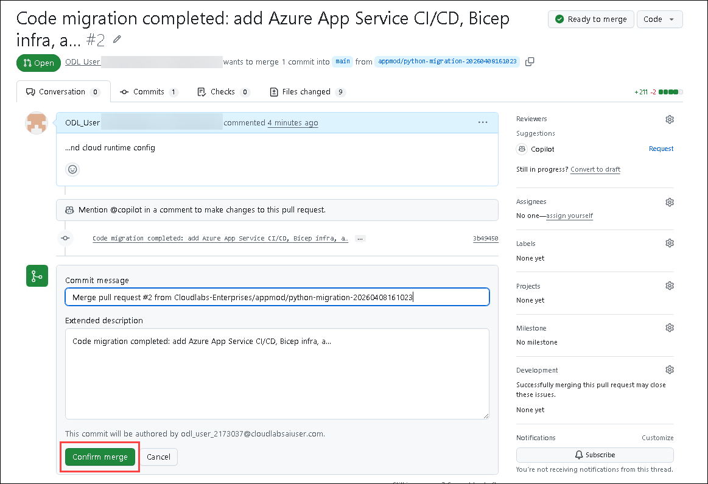

1. Visual Studio Code로 이동하여 **Terminal (1)** 을 열고 **New terminal (2)** 을 클릭합니다.

    

1. 다음 명령을 실행하여 모든 모더나이제이션 파일을 포함한 최신 변경 사항을 가져옵니다. 이렇게 하면 다음 실습을 진행하기 전에 로컬 환경이 최신 상태로 유지됩니다.

   ```bash
   git pull origin main
   ```
   


### 요약

이 실습에서는 GitHub Copilot과 modernization 확장을 사용하여 SmartHotel 애플리케이션을 모더나이즈했습니다. 레거시 코드를 분석하고, 클라우드 네이티브 개선 사항을 적용하며, 배포 준비가 완료된 구성을 생성했습니다. 마지막으로, Azure 배포를 위한 애플리케이션 준비를 완료했습니다.

오른쪽 하단의 **Next**를 클릭하여 다음 페이지로 이동합니다.

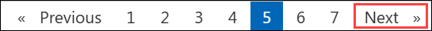
