# 실습 5: CI/CD 자동화 및 배포

### 예상 소요 시간: 90분

## 개요

이 실습에서는 이전 실습에서 GitHub Copilot이 생성한 배포 아티팩트를 사용하여 GitHub Actions를 통한 CI/CD 파이프라인을 구현합니다. 필요한 시크릿을 구성하고, 워크플로를 검토하며, 파이프라인을 트리거하고, SmartHotel 애플리케이션이 Azure App Service에 성공적으로 배포되었는지 확인합니다.

## 실습 목표

이 실습에서는 다음 작업을 완료합니다:

- 작업 1: 생성된 CI/CD 워크플로 검토
- 작업 2: 게시 프로필 다운로드를 위한 Azure App Service 구성
- 작업 3: Azure Web App 게시 프로필 다운로드
- 작업 4: GitHub 리포지토리 시크릿 추가
- 작업 5: 배포 워크플로 업데이트
- 작업 6: 애플리케이션 설정 및 시작 명령 구성
- 작업 7: CI/CD 파이프라인 트리거
- 작업 8: 애플리케이션 테스트

## 작업 1: 생성된 CI/CD 워크플로 검토

이 작업에서는 GitHub Copilot이 생성한 CI/CD 워크플로를 검토합니다.

1. Visual Studio Code의 **Explorer**에서 **`.github/workflows/`** 폴더로 이동하여 **`azure-deploy.yml`** 파일을 엽니다. 이 파일에는 다음 내용이 포함되어 있습니다:

    - 리포지토리 체크아웃
    - Python 설정
    - 종속성 설치
    - 애플리케이션 패키징
    - Azure App Service에 배포

        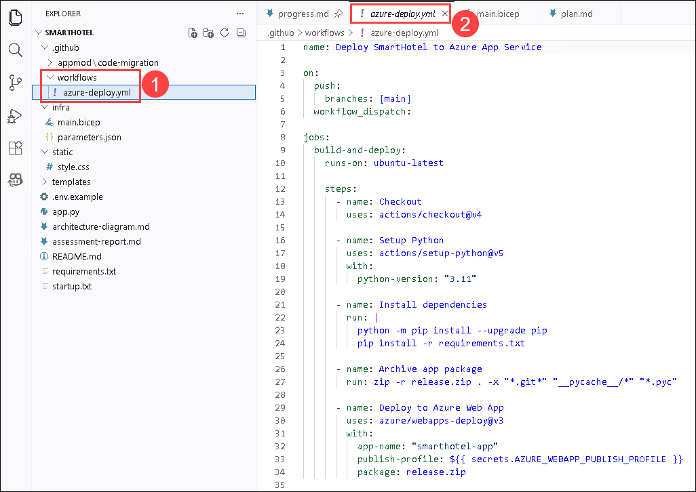

1. 워크플로가 배포에 다음 시크릿을 사용하는지 확인합니다:

    ```bash
    AZURE_WEBAPP_PUBLISH_PROFILE
    ```
    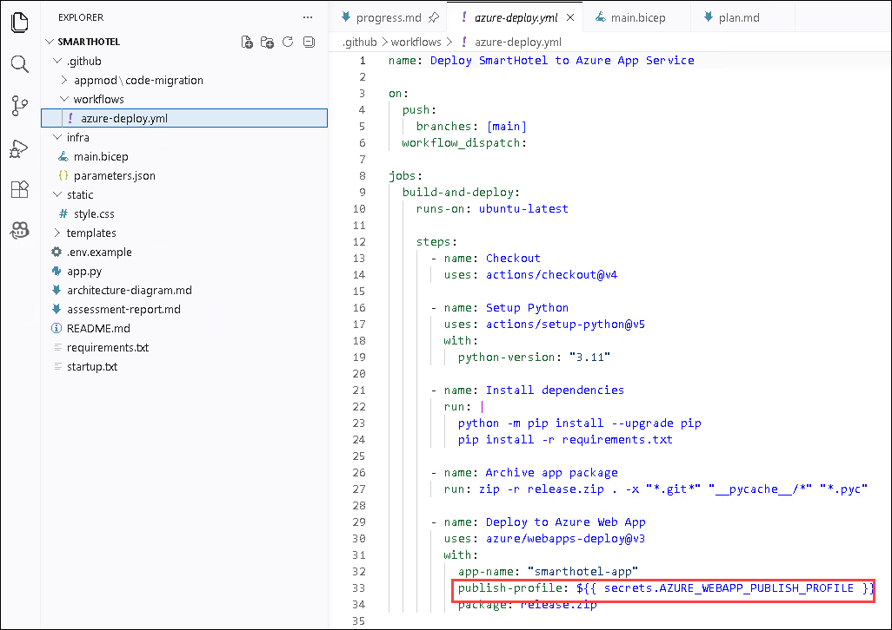

    >**참고:** 이 워크플로는 실습 4에서 생성되었으며, 이번 실습에서 애플리케이션을 배포하는 데 사용됩니다.

## 작업 2: 게시 프로필 다운로드를 위한 Azure App Service 구성

이 작업에서는 게시 프로필을 다운로드할 수 있도록 Azure App Service에서 필요한 게시 설정을 활성화합니다.

1. Azure Portal로 이동합니다. 상단 검색창에서 **App Services (1)**를 검색하고 **선택**합니다.

    

1. SmartHotel App Service (2)를 선택합니다.

    

1. 왼쪽 메뉴의 Settings에서 **Configuration (1)**을 클릭합니다. **General settings (2)** 탭을 선택합니다. 아래로 스크롤하여 Platform settings를 찾습니다. 다음 옵션을 활성화하고 **Apply (4)**를 클릭합니다.

    - **SCM Basic Auth Publishing Credentials (3)**
    - **FTP Basic Auth Publishing Credentials (3)**

        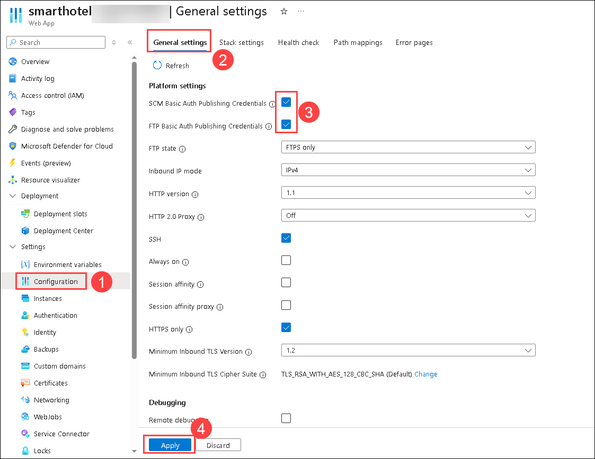

        >**참고:** 게시 프로필을 다운로드할 때 "Basic authentication is disabled" 메시지가 표시되면, 계속 진행하기 전에 이 설정이 활성화되어 있는지 확인하십시오.

## 작업 3: Azure Web App 게시 프로필 다운로드

이 작업에서는 Azure App Service에서 게시 프로필을 다운로드합니다. 이 파일은 GitHub Actions에서 배포를 안전하게 인증하는 데 사용됩니다.

1. App Service의 **Overview (1)** 페이지로 돌아갑니다. 상단 메뉴에서 **Download publish profile (2)**을 클릭합니다.

    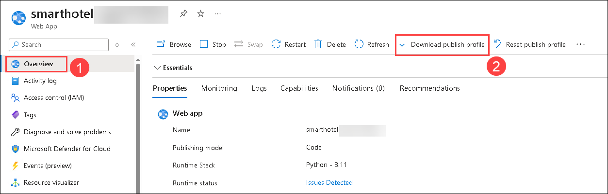

1. 다운로드된 파일을 클릭합니다. "Windows can't open this type of file (.PublishSettings)" 팝업이 나타나면 **Try an app on this PC**를 선택합니다.
    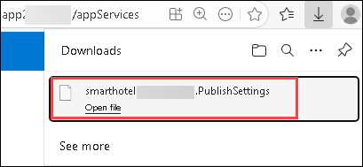

    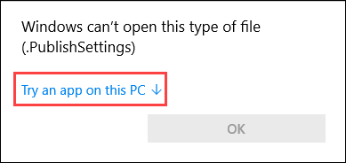

1. 목록에서 **Notepad**를 선택한 다음 **Ok**을 클릭합니다. 파일을 열어둔 채로 내용을 복사합니다.

    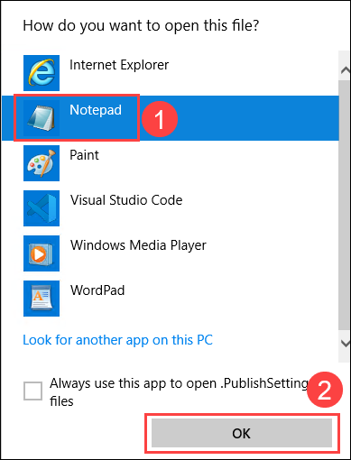

    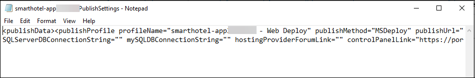

## 작업 4: GitHub 리포지토리 시크릿 추가

이 작업에서는 Azure 게시 프로필을 GitHub Secrets에 안전하게 저장하여 GitHub Actions 워크플로에서 사용할 수 있도록 합니다.

1. Edge 브라우저로 돌아가 GitHub 리포지토리를 엽니다. **Settings (1)**를 클릭합니다.

    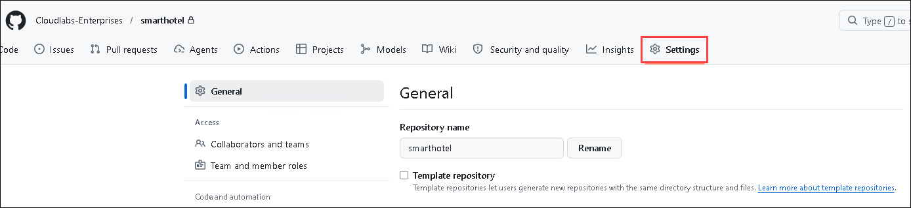

1. 아래로 스크롤하여 왼쪽 패널에서 **Secrets and variables (1)**를 선택한 다음 **Actions (2)**를 클릭합니다. **New repository secret (3)**을 클릭합니다.

    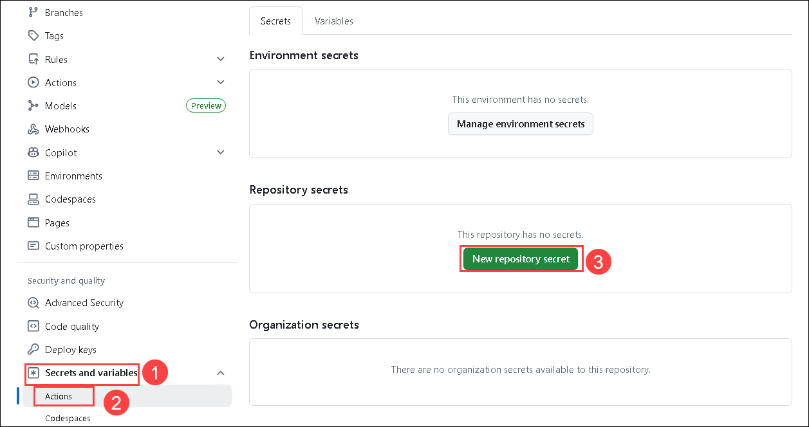

1. 다음 정보를 입력하고 **Add secret (3)**을 클릭합니다.

    - Name: **AZURE_WEBAPP_PUBLISH_PROFILE (1)**
    - Secret: **작업 3의 3단계에서 복사한 게시 프로필의 XML 내용을 붙여넣습니다 (2)**

        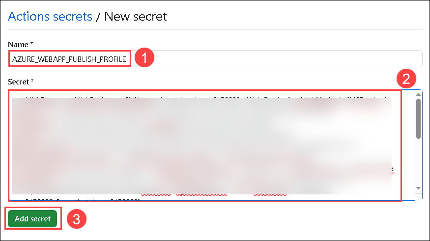

        > **참고:** 이 시크릿은 배포 시 azure-deploy.yml 워크플로에서 참조됩니다.

## 작업 5: 배포 워크플로 업데이트

이 작업에서는 생성된 워크플로 파일을 업데이트하여 Azure Web App 이름이 Azure에서 생성된 실제 App Service 이름과 일치하도록 합니다.

1. Visual Studio Code로 이동하여 **Explorer**에서 **`.github/workflows/azure-deploy.yml`**로 이동합니다.

    

1. 워크플로 파일에서 **app-name:** 필드를 찾습니다. 해당 값을 실제 Azure App Service 이름으로 변경한 다음 파일을 저장합니다.

    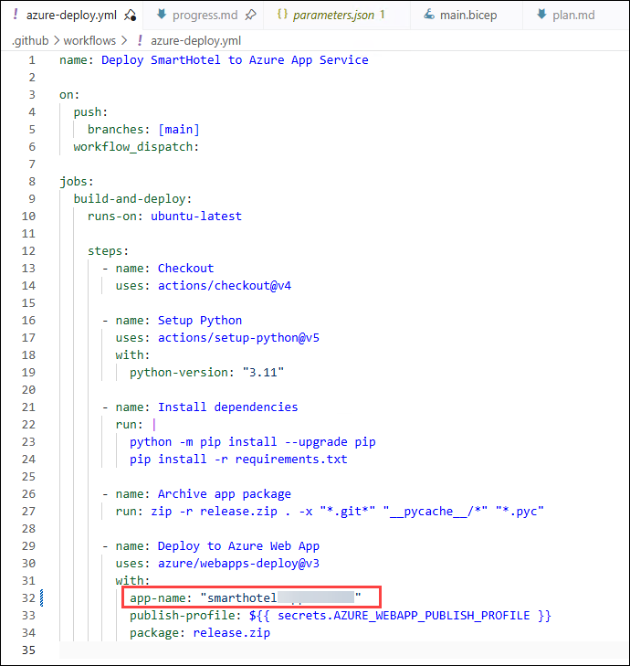

## 작업 6: 애플리케이션 설정 및 시작 명령 구성

이 작업에서는 애플리케이션이 Azure에서 성공적으로 실행되기 위해 필요한 런타임 설정을 구성합니다.

1. Azure Portal로 이동하여 검색창에서 **App Services (1)**를 검색한 다음 **(2)** 선택합니다.

    

1. **smarthotel** App Service를 선택합니다.

    

1. App Service의 왼쪽 메뉴에서 Settings 아래의 **Configuration** 옵션으로 이동합니다. **Stack settings**를 클릭하고 Startup command에 다음 명령을 입력한 후 **Apply**를 클릭합니다.

    ```bash
    gunicorn --bind=0.0.0.0 --timeout 600 app:app
    ```

    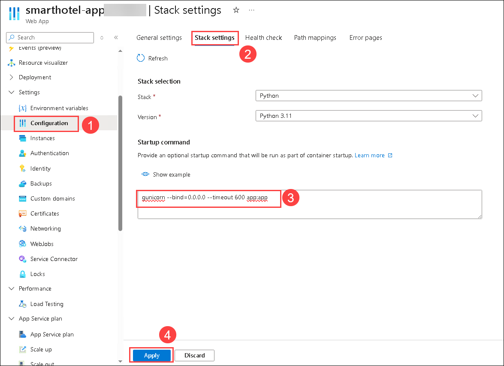

1. **Environment variables**로 이동하여 다음 변수를 하나씩 추가한 다음 **Apply**를 클릭하고 **Apply Changes**를 클릭합니다.

   | Name | Value |
   |--------------|----- |
   | SECRET_KEY | <inject key="DeploymentID" enableCopy="false"/> |
   | FLASK_DEBUG	 | false |
   | DATABASE_PATH | /home/site/wwwroot/hotel.db |
   | SESSION_COOKIE_SECURE | true |
   | SESSION_COOKIE_SAMESITE | Lax |
   | ADMIN_PASSWORD | admin123 |
   | SCM_DO_BUILD_DURING_DEPLOYMENT | true |

   	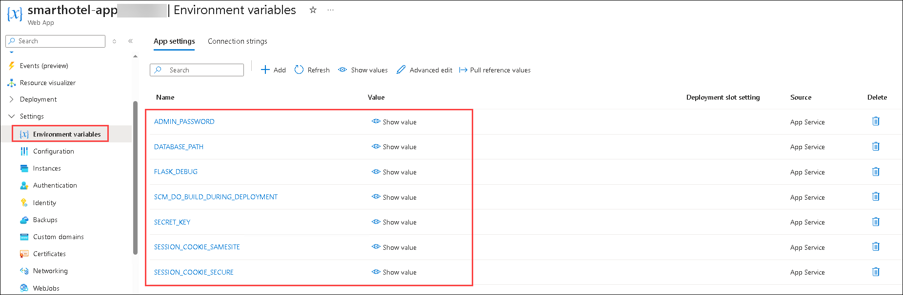
    	

## 작업 7: CI/CD 파이프라인 트리거

이 작업에서는 워크플로 변경 사항을 GitHub에 커밋하고 푸시하여 CI/CD 파이프라인을 자동으로 트리거하고 배포 프로세스를 실행합니다.

1. Visual Studio Code에서 **Terminal (1)**을 열고 **New terminal (2)**을 클릭합니다.
 

    
    
1. 다음 명령을 실행하여 애플리케이션 디렉토리로 이동합니다.

    ```bash
    cd C:\Projects\SmartHotel
    ```
1. 다음 명령을 실행하여 변경 사항을 GitHub에 커밋하고 푸시합니다.

    ```bash
    git checkout main
    git pull origin main
    git merge appmod/python-migration-<timestamp>
    git push origin main
    ```
    >**참고:** 모더나이제이션 브랜치 이름에는 타임스탬프가 포함되어 있으며 사용자 환경에 따라 다를 수 있습니다. 실제 브랜치 이름으로 변경하십시오.

    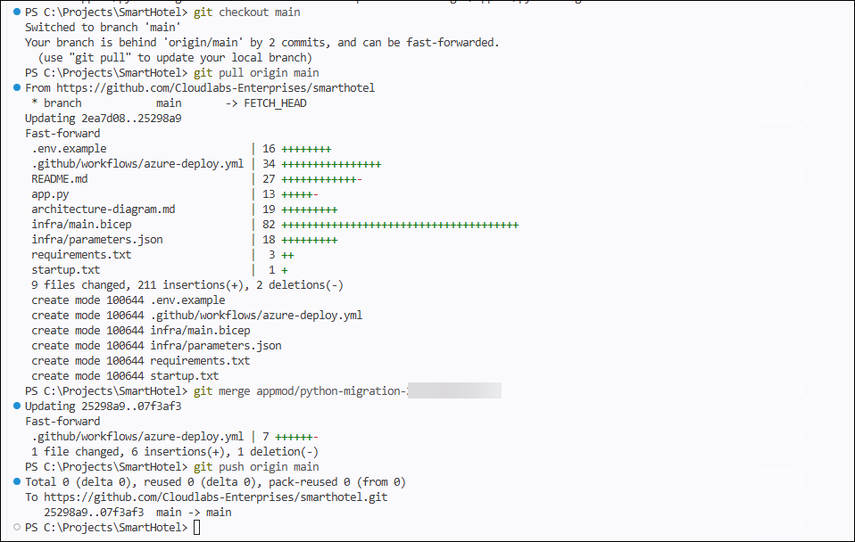

1. 변경 사항이 푸시되면 GitHub에서 리포지토리로 이동합니다. Actions 탭으로 이동하여 워크플로 실행을 열고 다음 단계를 모니터링합니다:

    - Checkout
    - Setup Python
    - Install dependencies
    - Archive app package
    - Deploy to Azure Web App

        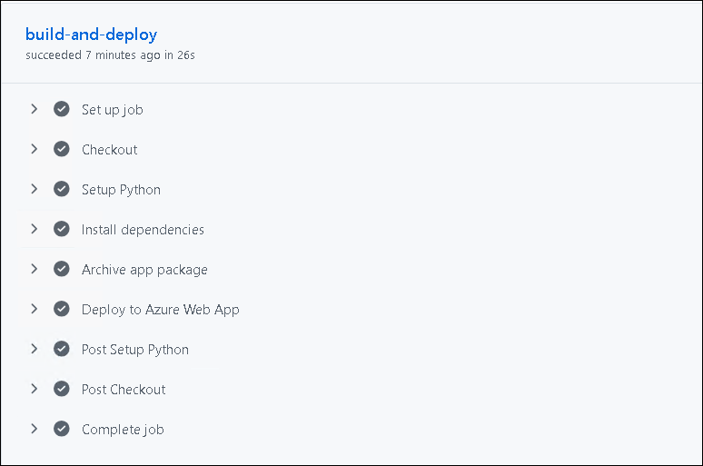

1. 워크플로가 성공적으로 완료될 때까지 기다립니다.

## 작업 8: 애플리케이션 테스트

이 작업에서는 Azure App Service URL을 통해 애플리케이션에 접속하고, 선택적으로 헬스 엔드포인트를 테스트하여 배포가 성공적으로 완료되었는지 확인합니다.

1. Azure Portal로 이동하여 검색창에서 **App Services (1)**를 검색한 다음 **(2)** 선택합니다.

    

1. **smarthotel** App Service를 선택한 다음 Overview 페이지에서 **Default domain URL**을 클릭합니다.

    

    

1. 애플리케이션이 성공적으로 로드되는지 확인합니다.

    

1. 다음 자격 증명을 입력하고 **Login**을 선택합니다.

    - Username: admin
    - Password: admin123

        
    
1. 선택 사항으로, 도메인 URL 끝에 **/health**를 추가하여 헬스 엔드포인트를 테스트합니다.

    

### 요약

이 실습에서는 GitHub Copilot이 생성한 GitHub Actions 워크플로를 검토하고 Azure App Service에 필요한 배포 설정을 구성했습니다. 게시 프로필 다운로드를 활성화하고, 게시 프로필을 GitHub 리포지토리 시크릿으로 추가했으며, 올바른 App Service 이름으로 워크플로를 업데이트하고, 필요한 시작 명령 및 애플리케이션 설정을 구성했습니다. 마지막으로 CI/CD 파이프라인을 트리거하고 배포된 SmartHotel 애플리케이션을 검증했습니다.

오른쪽 하단의 **Next**를 클릭하여 다음 페이지로 이동합니다.


