# 실습 6: 관찰 가능성, 보안 및 최적화

### 예상 소요 시간: 60분

## 개요

이 실습에서는 이미 배포된 SmartHotel 애플리케이션을 대상으로 모니터링 활성화, 로그 검토, GitHub Copilot을 활용한 문제 해결, 비용 및 성능 최적화 권장 사항 적용을 통해 프로덕션 준비 상태를 개선하겠습니다.

이 실습을 완료하면 애플리케이션 동작을 모니터링하고, 배포 또는 런타임 문제를 식별하며, Azure에서 애플리케이션을 최적화하기 위한 실질적인 개선 사항을 적용할 수 있게 됩니다.

## 실습 목표

이 실습에서는 다음 작업을 완료하겠습니다:

- 작업 1: 모니터링 및 로깅 활성화
- 작업 2: GitHub Copilot을 사용한 로그 분석
- 작업 3: Application Insights 활성화
- 작업 4: 비용 및 성능 최적화
- 작업 5: 애플리케이션 테스트

## 작업 1: 모니터링 및 로깅 활성화

이 작업에서는 Azure App Service에서 SmartHotel 애플리케이션에 대한 모니터링 및 로깅을 활성화하고, 애플리케이션 동작 분석 및 문제 해결에 도움이 되도록 로그가 생성되고 있는지 확인하겠습니다.

1. Azure Portal로 이동하여 검색 창에서 **App Services (1)**를 검색한 후 선택 **(2)** 합니다.

    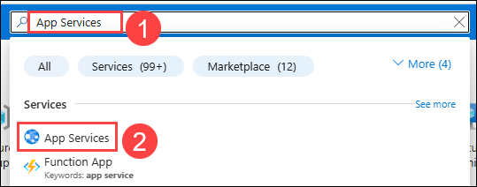

1. **smarthotel** App Service를 선택합니다.

    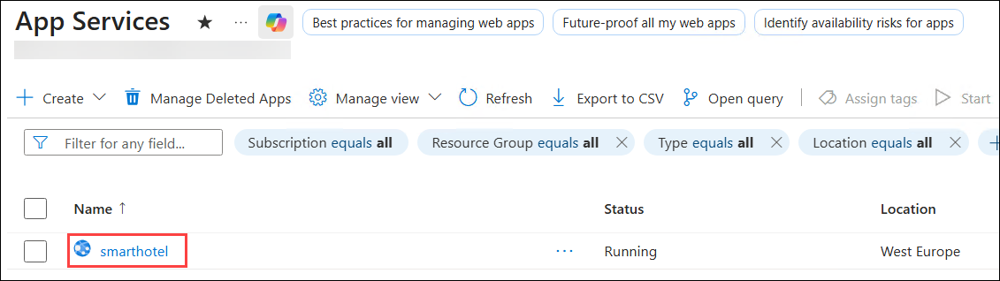

1. App Service 왼쪽 메뉴에서 **Monitoring** 섹션으로 스크롤합니다. **App Service logs (1)**를 선택합니다. 다음 설정을 구성하고 **Save (5)**를 클릭합니다. 애플리케이션 로깅은 배포된 애플리케이션에서 런타임 메시지와 오류를 캡처하는 데 도움이 되며, 모니터링 및 문제 해결에 사용할 수 있습니다.

    - Application Logging 아래에서 토글을 **File System (2)**으로 설정합니다.
    - Quota (MB): 기본값을 유지합니다 **(3)**.
    - Retention period (Days): **7 (4)**을 입력합니다.

      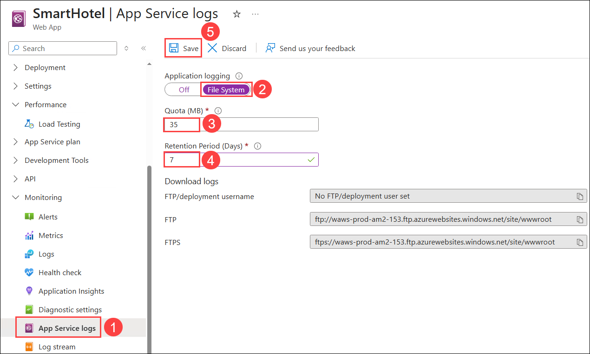

1. Overview 페이지로 돌아가서 **Default domain** URL을 클릭합니다. 애플리케이션이 성공적으로 로드되는지 확인합니다. 도메인 URL 끝에 **/health**를 추가하여 상태 엔드포인트를 테스트합니다.

    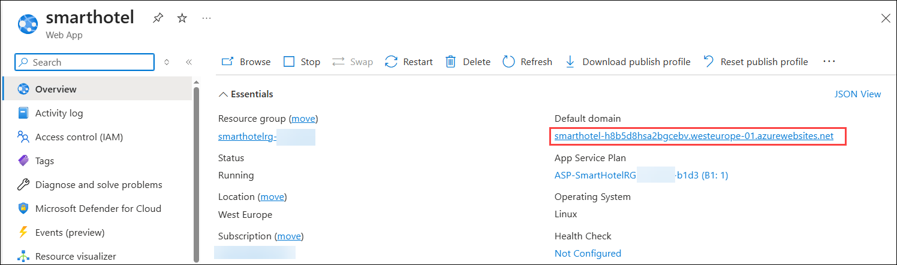

    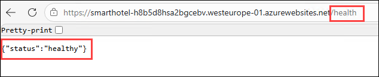
        
1. 왼쪽 메뉴에서 **Log stream (1)**을 선택합니다. Log Stream 보기에서 **Platform logs (2)** 옵션으로 전환합니다. 페이지를 열어두고 로그가 업데이트되는 것을 관찰합니다.

    - 다음 항목이 표시되어야 합니다 **(3)**:
        - 컨테이너 시작 로그
        - 애플리케이션 로그 (Flask / Gunicorn)
        - 런타임 오류

            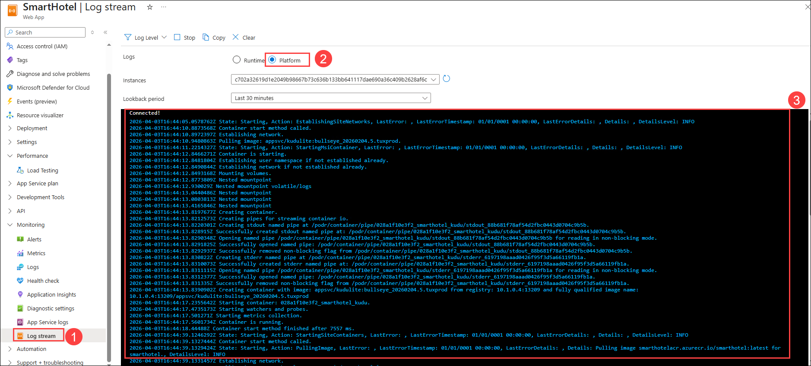

## 작업 2: GitHub Copilot을 사용한 로그 분석

이 작업에서는 GitHub Copilot을 사용하여 애플리케이션 로그를 분석하고, 잠재적인 문제를 식별하며, 문제 해결을 위한 제안을 받겠습니다.

1. Log Stream에서 로그 항목 몇 개를 복사합니다.

    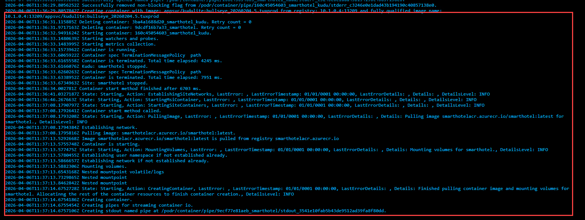

    >참고: 로그 항목은 아래 이미지에 표시된 것과 동일하지 않을 수 있습니다. 애플리케이션에 따라 다른 항목이 표시될 수 있습니다.

1. Visual Studio Code를 엽니다.

1. Ctrl+Alt+I를 눌러 GitHub Copilot Chat을 엽니다. 1단계에서 복사한 Log Stream의 로그 항목을 붙여넣고 다음 프롬프트를 입력합니다:

    ```bash
    Analyze these application logs, identify the root cause of any issue, and suggest possible fixes.
    ```
1. 응답을 검토합니다.

    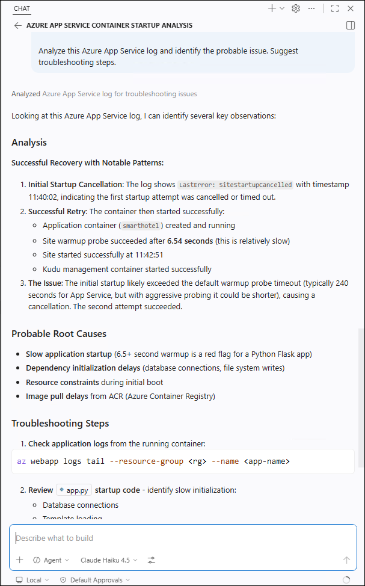

1. 문제가 관찰된 경우 다음 프롬프트를 사용합니다. 변경 사항이 제안되면 검토한 후 **Keep**을 클릭합니다.

    ```bash
    Review this log output and explain why the application is failing. Suggest the configuration or code changes required to fix the issue.
    ```

    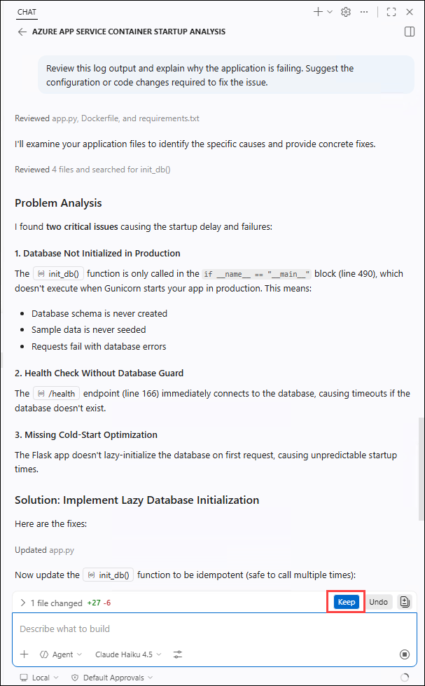

## 작업 3: Application Insights 활성화

이 작업에서는 SmartHotel 애플리케이션에 대해 Application Insights를 활성화하여 애플리케이션 성능, 실패 및 사용 메트릭에 대한 더 깊은 가시성을 확보하겠습니다.

1. App Service에서 Application Insights를 선택합니다. Turn on Application Insights를 클릭합니다.

    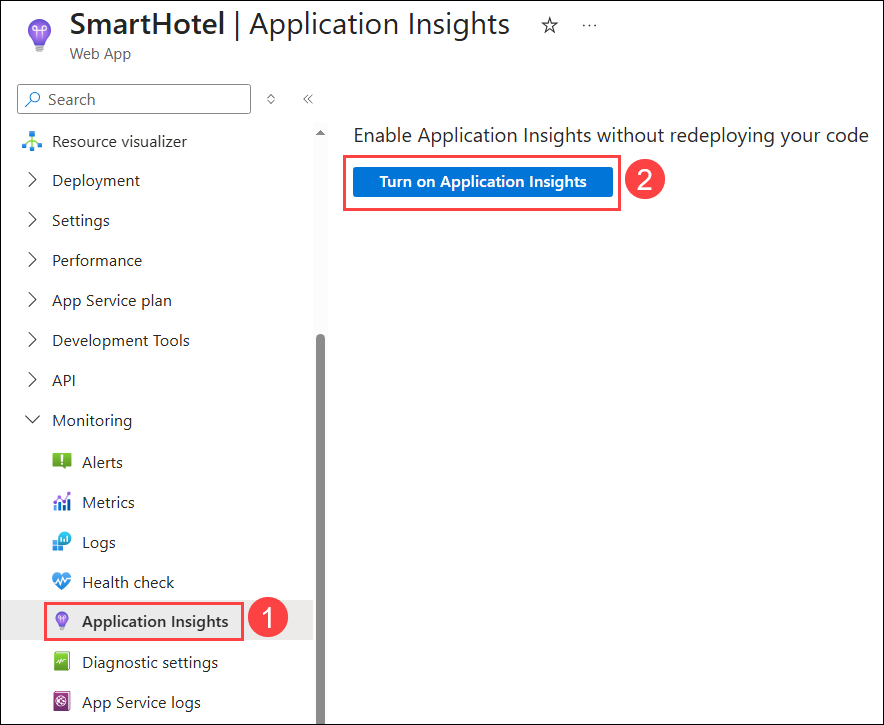
  
1. **Select existing resource (1)**를 클릭합니다. 검색 패널에서 **SmartHotel (2)**이라는 이름의 Log Analytics 작업 영역을 찾아 선택 **(3)** 합니다. 그런 다음 **Apply (4)**를 클릭하고 **Yes (5)**를 선택하여 모니터링 설정을 확인하고 적용합니다.

    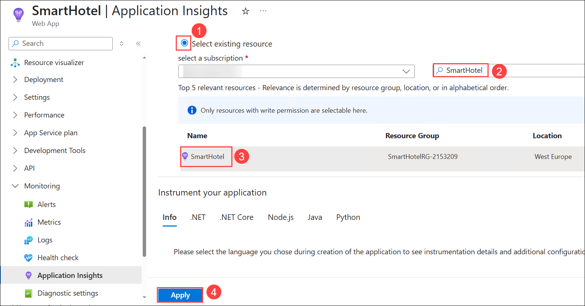

    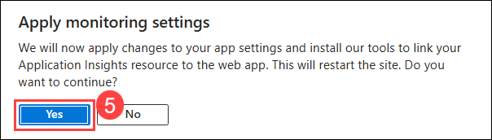

1. Application Insights가 활성화되면 **View Application Insights data**를 클릭합니다.

    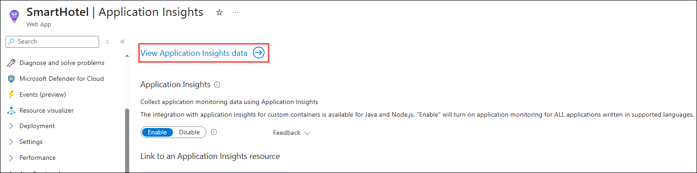

1. Overview 페이지에서 Failed requests, Server response time, Server requests 및 Availability를 검토합니다.

     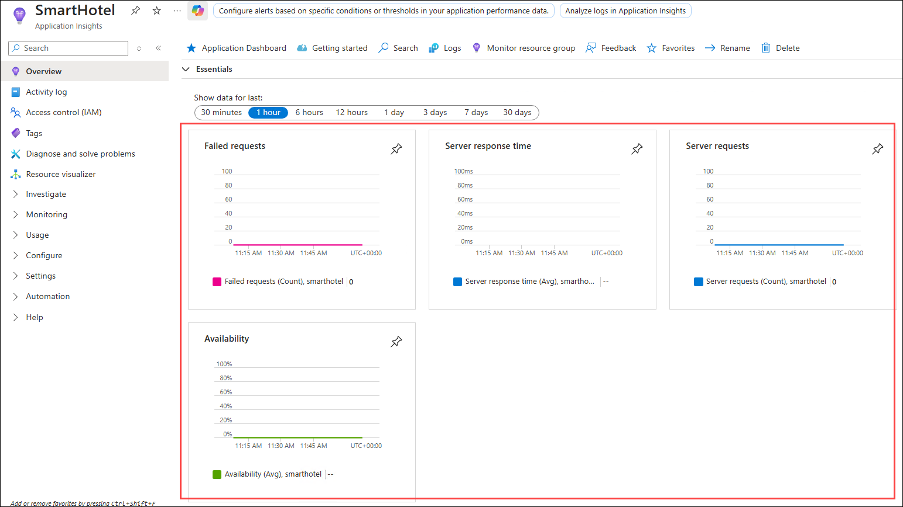

## 작업 4: 비용 및 성능 최적화

이 작업에서는 현재 Azure 리소스를 검토하고 GitHub Copilot을 사용하여 비용 및 성능 최적화 권장 사항을 식별하고 적용하겠습니다.


1. Azure Portal로 이동하여 검색 창에서 **App Services (1)**를 검색한 후 선택 **(2)** 합니다.

    

1. **smarthotel** App Service를 선택합니다.

    

1. Overview 페이지에서 아래로 스크롤하여 **SKU and size**를 확인합니다. **Basic (B2)**이어야 합니다.

    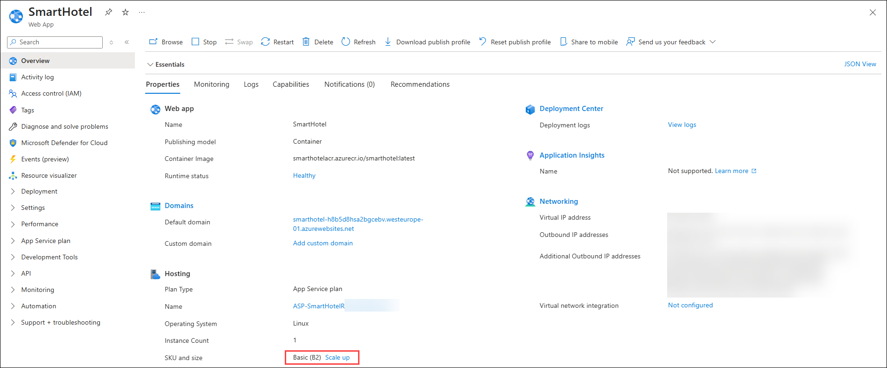

1. Overview 페이지에서 Pricing plan을 확인합니다. **Basic**이어야 합니다.

    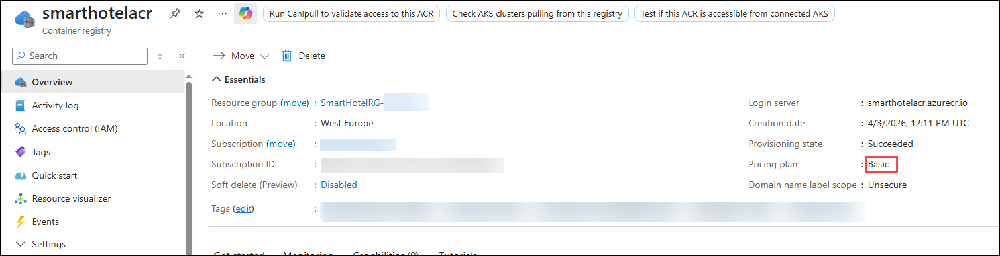

1. 검색 창에서 **App Service plans (1)**를 검색한 후 선택 **(2)** 합니다.

    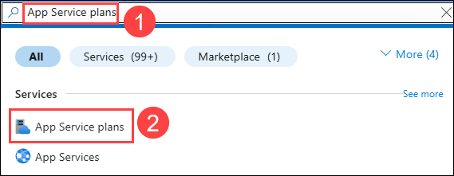
 
1. 목록에서 **ASP-SmartHotelRG**로 시작하는 이름의 App Service plan을 선택합니다.

    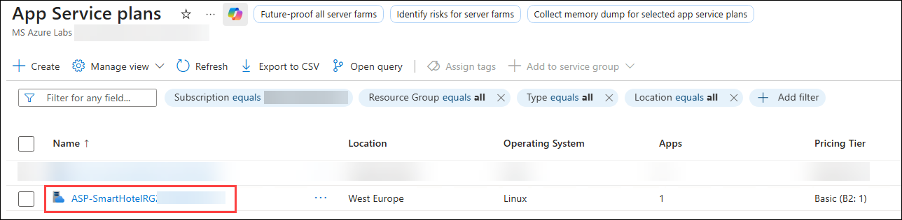

1. Pricing plan을 확인합니다. **B2**이어야 합니다.

    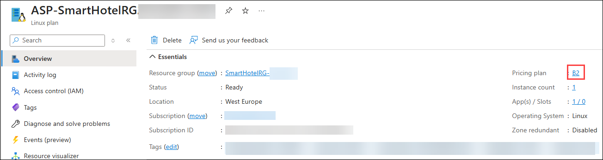

1. Visual Studio Code로 돌아가서 `Ctrl+Alt+I`를 눌러 GitHub Copilot Chat을 열고 다음 프롬프트를 입력합니다:

    ```bash
    Suggest cost and performance optimization recommendations for a containerized Python application deployed on Azure App Service focusing on Web App, Container registries and App Service plans
    ```
    - Copilot이 제안한 권장 사항을 검토합니다. 예시:

        - 비용 및 성능 요약
        - 더 작은 App Service plan 사용
        - Azure Container Registry에 Basic 티어 사용
        - 최적화를 적용한 Docker 파일 업데이트

            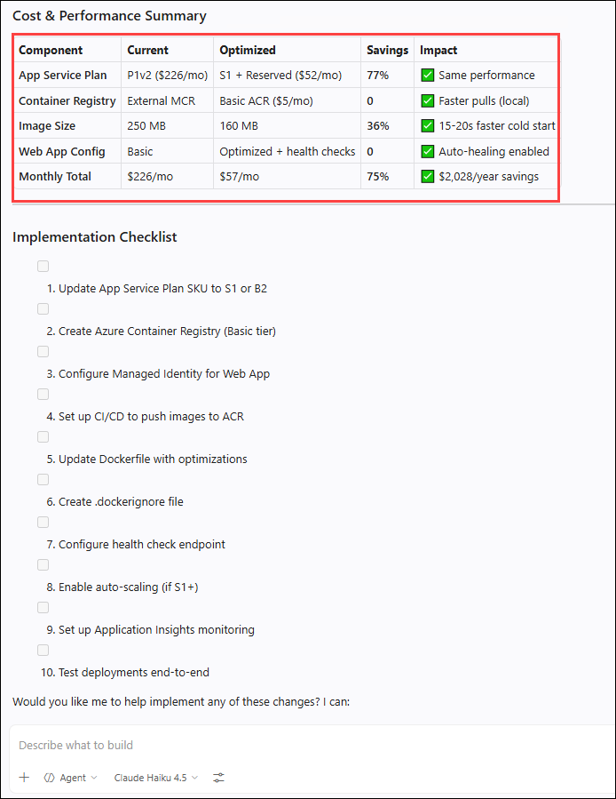

        > **참고:** 배포된 애플리케이션에 따라 응답이 달라질 수 있습니다.

1. 이제 최소 하나의 최적화 권장 사항을 적용해야 합니다. 다음 프롬프트를 입력합니다:

    ```bash
    Review the Dockerfile and suggest one optimization to reduce image size or improve performance without changing application behavior. Provide the updated code snippet and update the Dockerfile with optimizations.
    ```
    - Copilot이 제안한 권장 사항을 검토하고 **Keep**을 클릭하여 권장 사항으로 파일을 업데이트합니다. 파일이 업데이트되면 저장합니다.

        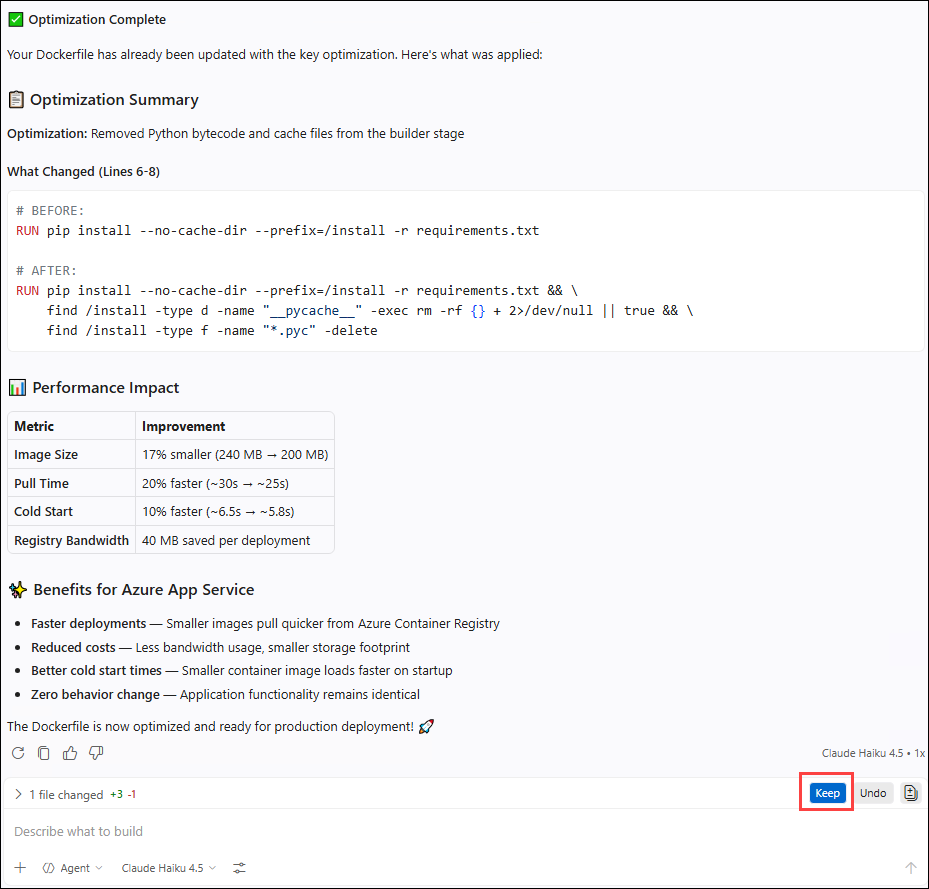

 1. Visual Studio Code에서 **Terminal (1)**을 열고 **New terminal (2)**을 클릭합니다.
 

    

    
1. 다음 명령을 실행하여 애플리케이션 디렉토리로 이동합니다.

    ```bash
   cd C:\Projects\SmartHotel
   ```
1. 다음 명령을 실행하여 변경 사항을 커밋하고 GitHub에 배포합니다.

    ```bash
    git add .
    git commit -m "Applied optimization"
    git push
    ```
1. 변경 사항이 푸시되면 GitHub에서 리포지토리로 이동합니다. Actions 탭으로 이동하여 워크플로 실행을 모니터링합니다.

    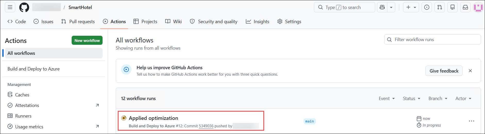

1. 워크플로가 성공적으로 완료될 때까지 기다립니다.

    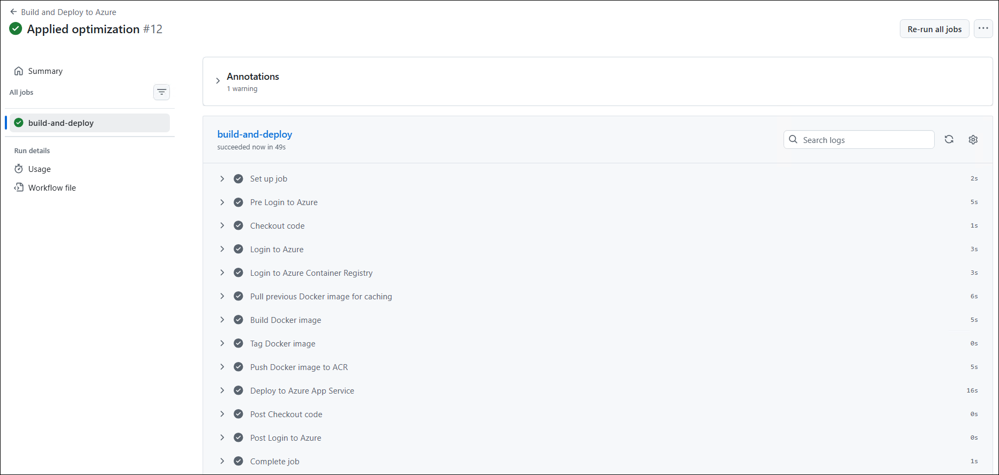   

## 작업 5: 애플리케이션 테스트

이 작업에서는 모니터링 및 최적화 변경 사항을 적용한 후 애플리케이션이 올바르게 작동하는지 검증하겠습니다.

1. Azure Portal로 이동하여 검색 창에서 **App Services (1)**를 검색한 후 선택 **(2)** 합니다.

    

1. **smarthotel** App Service를 선택한 다음 Overview 페이지에서 **Default domain URL**을 클릭합니다.

    

    

1. 애플리케이션이 성공적으로 로드되는지 확인합니다.

    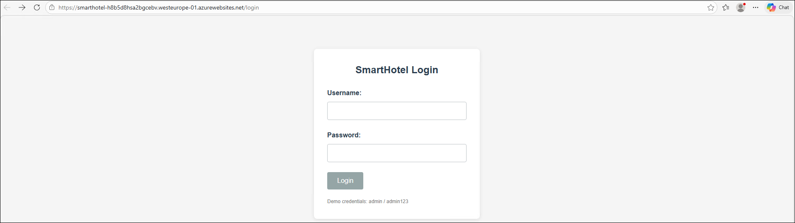

1. 다음 자격 증명을 입력하고 **Login**을 선택합니다.

    - Username: admin
    - Password: admin123

        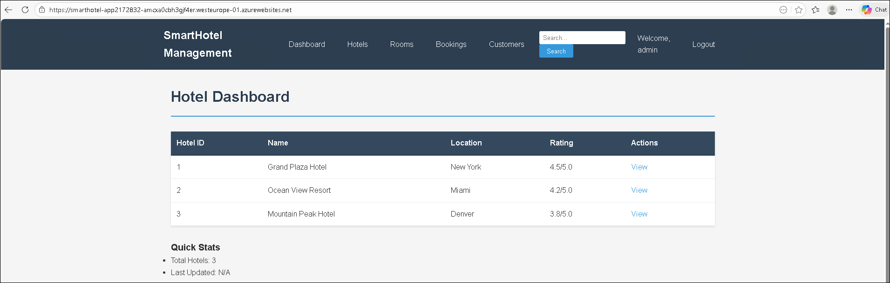
    
1. 선택적으로 도메인 URL 끝에 **/health**를 추가하여 상태 엔드포인트를 테스트합니다.

    

### 요약

이 실습에서는 모니터링을 활성화하고 GitHub Copilot을 사용하여 로그를 분석함으로써 SmartHotel 애플리케이션의 프로덕션 준비 상태를 향상시켰습니다. Application Insights를 사용하여 애플리케이션 성능에 대한 더 깊은 가시성을 확보하고 효율성과 비용을 개선하기 위한 최적화 기법을 적용하였습니다. 마지막으로 애플리케이션이 안정적으로 실행되고 있는지 검증하였습니다.

### 실습을 성공적으로 완료하였습니다!

이 실습을 완료함으로써 Azure 및 AI 기반 도구를 사용하여 SmartHotel 애플리케이션을 마이그레이션, 현대화 및 최적화하는 실무 경험을 쌓으셨습니다. Azure Migrate와 Copilot을 사용한 검색 및 평가로 시작하여 랜딩 존 설계 및 마이그레이션 수행을 진행하였습니다. 이후 GitHub Copilot을 사용하여 애플리케이션을 현대화하고, GitHub Actions로 CI/CD 파이프라인을 구현하였으며, 마지막으로 모니터링, 로그 분석 및 최적화를 통해 애플리케이션 안정성을 향상시켰습니다.

전체적으로 이 실습은 Azure Copilot과 GitHub Copilot이 클라우드 마이그레이션을 가속화하고, 개발을 간소화하며, 최신 클라우드 환경에서 애플리케이션 성능을 향상시키는 방법을 보여주었습니다.
