# Azure Copilot 기반 마이그레이션

## 전체 예상 소요 시간: 8시간

## 개요

이 실습에서는 Azure Copilot의 도움을 받아 워크로드를 Azure로 마이그레이션하고 현대화합니다. 먼저 Azure Migrate와 Azure Site Recovery를 사용하여 Windows 및 SQL Server 워크로드를 평가하고 마이그레이션합니다. 다음으로, Red Hat VM 및 OSS DB 워크로드를 복제하고 마이그레이션하며, Entra ID 기반 인증을 활성화하고 Azure Automanage에 연결합니다. 마지막으로, Azure Arc를 사용하여 Windows 머신을 관리하고, Azure Site Recovery를 통한 재해 복구(테스트 장애 조치 및 Azure VM으로의 장애 조치 포함)를 수행합니다.

### Azure 인프라 마이그레이션의 주요 기능

- **Azure Copilot:** 서버를 검색하고, 위험 평가, VM 평가, 비용 추정을 생성하며, Landing Zone 배포를 위한 IAC Terraform 코드를 제공합니다.

- **원활한 워크로드 마이그레이션:** Azure Migrate와 Azure Site Recovery(ASR)를 사용하여 Windows, SQL Server, Linux 및 오픈소스 데이터베이스 워크로드를 마이그레이션합니다. 이를 통해 온프레미스 또는 다른 클라우드에서 Azure로 애플리케이션과 데이터를 효율적이고 안전하게 이동할 수 있습니다.

- **포괄적인 마이그레이션 사전 설정:** 적절한 네트워킹, 리소스 그룹 및 마이그레이션 도구를 사용하여 Azure 환경을 설정합니다. 기본 제공 가이드를 활용하여 서버 마이그레이션 및 현대화를 위한 인프라가 준비되었는지 확인하십시오.

- **통합 애플리케이션 및 데이터 마이그레이션:** Azure Migrate: Server Migration과 Azure Hybrid Benefit 같은 도구를 사용하여 최소한의 다운타임으로 앱과 데이터베이스를 전환합니다. 여기에는 애플리케이션 구성, 데이터베이스 및 종속성 마이그레이션에 대한 엔드투엔드 지원이 포함됩니다.

- **마이그레이션된 워크로드 최적화:** 마이그레이션 후, 성능, 비용 및 보안을 위해 워크로드를 최적화합니다. Azure 도구는 비효율성을 식별하고 모든 스택에서 확장, 리소스 적정 규모 조정 및 모범 사례 구현을 가능하게 합니다.

- **Linux 및 OSS 데이터베이스 현대화:** Azure의 맞춤형 솔루션을 활용하여 Linux 워크로드 및 오픈소스 데이터베이스를 현대화합니다. Azure는 이러한 환경의 호환성을 보장하고 확장 및 최적화를 위한 지원을 제공합니다.

- **Azure Arc를 통한 하이브리드 클라우드 지원:** Azure Arc 지원 서버를 사용하여 온프레미스 서버로 Azure 관리 기능을 확장합니다. 이를 통해 하이브리드 환경에 대한 중앙 집중식 모니터링, 정책 적용 및 관리가 가능합니다.

- **고급 재해 복구 및 장애 조치:** Azure Site Recovery(ASR)를 구성하여 온프레미스 인프라를 보호합니다. Azure Cloud로의 테스트 장애 조치 및 장애 조치 작업을 수행하여 재해 발생 시 비즈니스 연속성을 보장합니다.

- **통합 보안 및 모니터링:** Microsoft Defender for Cloud, Microsoft Sentinel 및 Azure Monitor를 활성화하여 마이그레이션 후 워크로드를 보호합니다. Log Analytics와 통합하여 환경 전반에 걸친 실시간 인사이트 및 위협 탐지를 수행합니다.

- **전략적 인사이트를 위한 비즈니스 사례 분석:** 비즈니스 사례 분석을 수행하여 마이그레이션의 재정적 및 운영적 이점을 평가합니다. Azure의 보고 도구를 활용하여 비용 절감, 성능 향상 및 ROI를 평가하십시오.

- **통합 관리 및 자동화:** Azure의 중앙 집중식 플랫폼을 사용하여 마이그레이션된 모든 워크로드를 관리하고, 프로세스를 자동화하며, 인프라 전반에 걸쳐 일관된 거버넌스, 보안 및 규정 준수를 적용합니다.

## 실습 시나리오

다음 실습에서는 복잡한 설정이나 설치가 필요 없는 온프레미스 환경을 통해 Azure Migrate를 빠르고 쉽게 시작할 수 있는 방법을 제공합니다.

이 실습(HOL)에서는 SmartHotel이 대규모 호텔 회사라고 가정합니다.

SmartHotel의 IT 시스템은 온프레미스 데이터 센터, 유통 센터 및 여러 퍼블릭 클라우드에 걸쳐 Windows, Linux, SQL Server 및 MySQL을 운영하고 있습니다. 이로 인해 SmartHotel은 운영상의 어려움을 겪고 있습니다. SmartHotel은 이러한 서로 다른 환경 전반에서 일관된 거버넌스 및 운영 방식을 확보하고, 조직 전체의 보안을 보장하며, 규제 및 규정 준수 요구 사항을 충족하면서도 최신 데이터베이스 기술의 혁신을 활용하고 혁신과 개발자 민첩성을 지원하고자 합니다.

## 목표

- **마이그레이션 평가 및 계획:** Azure Migrate를 사용하여 현재 환경을 평가하고, 마이그레이션 평가를 생성하며, 종속성 시각화를 구성하여 원활한 전환을 보장합니다.

- **Azure 환경 설정:** 스토리지 계정 생성, Hyper-V 호스트 등록, 복제 활성화 및 네트워킹 구성을 통해 마이그레이션을 위한 Azure 환경을 준비합니다.

- **워크로드 마이그레이션:** Azure Migrate와 Azure Site Recovery를 사용하여 Windows, SQL Server, Linux 및 OSS DB 워크로드를 마이그레이션하고, 최소한의 다운타임과 Azure의 확장성을 활용합니다.

- **워크로드 최적화:** VM Scale Sets, Azure Automanage 및 Linux용 Azure Active Directory SSH Login을 사용하여 마이그레이션된 워크로드의 성능과 복원력을 향상시킵니다.

- **재해 복구 및 보안:** Azure Site Recovery를 사용하여 재해 복구 계획을 구현하고, 테스트 장애 조치를 수행하며, Azure VM으로의 장애 조치를 활성화합니다. Microsoft Defender for Cloud, Microsoft Sentinel 및 Azure Monitor를 사용하여 보안을 강화합니다.

- **비즈니스 사례 분석:** 비즈니스 사례 분석을 수행하여 Azure Services에 대한 규정 준수를 보장하고 리소스 관리를 최적화합니다.

## 사전 요구 사항

- **Azure 환경 접근 권한:** Azure Migrate 및 Azure Site Recovery(ASR) 활성화를 포함하여 리소스를 배포하고 구성하는 데 필요한 권한이 있는 활성 Azure 구독이 필요합니다.

- **Azure 서비스 및 마이그레이션 도구 숙지:** 원활한 마이그레이션을 위해 Azure 개념, 리소스 관리, Azure Migrate, Azure Hybrid Benefit 및 ASR 같은 마이그레이션 도구에 대한 기본적인 이해가 필요합니다.

- **기술 환경 준비:** 필요한 에이전트가 설치되고, 서버 검색이 활성화되며, 마이그레이션 준비를 위한 애플리케이션 호환성이 평가된 온프레미스 환경이 준비되어야 합니다.

## 아키텍처

아키텍처 다이어그램은 워크로드를 Azure로 마이그레이션하고, Azure 서비스를 구성하며, Microsoft 도구를 활용하여 최적화 및 모니터링하는 일련의 실습을 보여줍니다. 실습은 Windows, SQL Server, Linux 및 OSS 데이터베이스 워크로드 마이그레이션, 마이그레이션 환경 설정, Azure Migrate 및 Azure Hybrid Benefit 같은 도구를 활용한 애플리케이션 및 데이터 전환으로 시작됩니다. 이후 사용자는 온프레미스 서버를 Azure Arc 지원으로 온보딩하고, 장애 조치를 위한 Azure Site Recovery(ASR)를 구성하며, 인프라를 Azure로 마이그레이션합니다. 이어서 Microsoft Defender for Cloud, Sentinel 및 Azure Monitor를 활성화하고 보안 및 모니터링을 위한 Log Analytics를 설정하며, 최종적으로 비즈니스 사례 분석 기능을 제공하여 Azure 마이그레이션, 최적화 및 보안 운영에 대한 포괄적인 이해를 돕습니다.

## 아키텍처 다이어그램

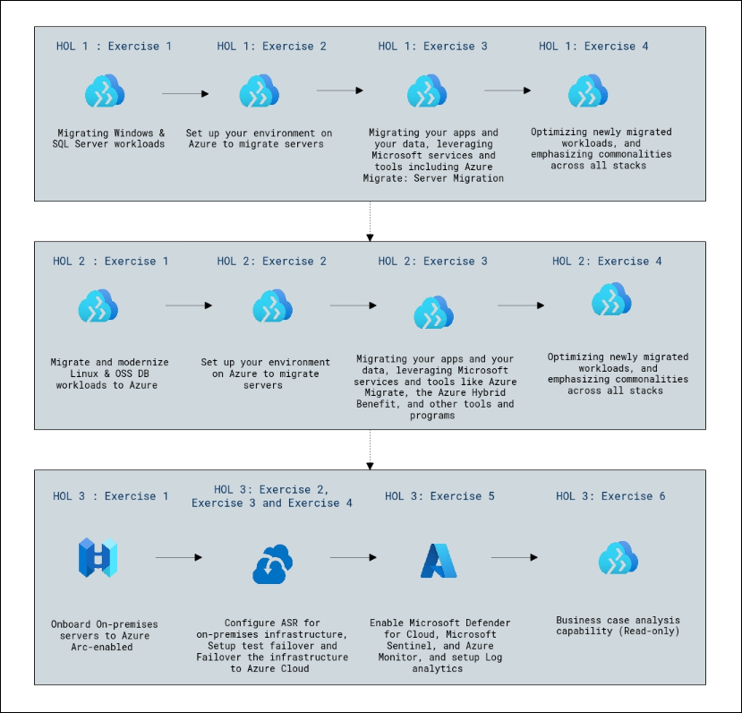

## 구성 요소 설명

- **Azure Copilot:** Azure Copilot은 Azure의 AI 기반 어시스턴트로, 자연어를 사용하여 리소스 관리, 작업 자동화, 구성 생성, 문제 해결 및 인사이트 제공을 지원하며 생산성과 운영 효율성을 향상시킵니다.

- **Azure Migrate:** 온프레미스 서버, 애플리케이션 및 데이터베이스를 검색, 평가 및 Azure로 마이그레이션하기 위한 중앙 집중식 허브입니다. 워크로드 분석, 비용 추정 및 원활한 마이그레이션을 위한 도구를 제공하여 마이그레이션 계획 및 실행을 간소화합니다.

- **Azure Arc:** 온프레미스 서버 및 기타 비Azure 리소스를 Azure의 관리 도구와 통합할 수 있게 하여, 조직이 통합된 Azure 인터페이스를 통해 하이브리드 환경 전반에서 리소스를 관리, 보호 및 제어할 수 있도록 합니다.

- **Azure Site Recovery(ASR):** 온프레미스 서버를 Azure로 복제하는 재해 복구 솔루션으로, 장애 또는 시스템 오류 발생 시 비즈니스 연속성을 보장하기 위해 워크로드의 장애 조치 및 장애 복구를 지원합니다.

- **Microsoft Defender for Cloud:** Azure, 온프레미스 및 기타 클라우드 플랫폼에서 실행되는 워크로드에 대한 가시성과 보호를 제공하는 보안 관리 도구입니다. 위협 탐지, 보안 태세 관리 및 규정 준수 보장을 지원합니다.

- **Microsoft Sentinel:** 보안 데이터를 수집하고, 위협을 탐지하며, 플레이북 및 분석을 통해 인시던트 대응을 가능하게 하는 클라우드 네이티브 SIEM(보안 정보 및 이벤트 관리) 및 SOAR(보안 오케스트레이션, 자동화된 대응) 솔루션입니다.

- **Azure Monitor:** Azure 리소스, 온프레미스 환경 및 기타 클라우드에서 텔레메트리 데이터를 수집, 분석 및 처리하여 애플리케이션과 인프라의 성능 및 상태에 대한 인사이트를 제공하는 서비스입니다.

- **Log Analytics:** Azure Monitor 내의 도구로, Azure 리소스의 로그 데이터를 쿼리하고 분석하여 인사이트를 얻고, 문제를 해결하며, 운영 효율성을 향상시킬 수 있습니다.

- **Azure Hybrid Benefit:** 기존 온프레미스 Windows Server 및 SQL Server 라이선스를 클라우드에서 사용할 수 있도록 하여, 조직이 워크로드를 Azure로 마이그레이션할 때 비용을 절감할 수 있는 라이선스 혜택입니다.

- **비즈니스 사례 분석:** 조직이 워크로드를 Azure로 마이그레이션하는 재정적 및 운영적 이점을 평가할 수 있도록 설계된 읽기 전용 기능으로, 비용 최적화 및 ROI에 대한 인사이트를 제공합니다.

## 실습 시작하기

Infrastructure Migration 실습에 오신 것을 환영합니다. 필요한 모든 도구와 계정에 접근할 수 있는지 확인하시고, 각 작업을 주의 깊게 읽고 순서대로 단계를 수행하십시오. 실습 전반에 걸쳐 제공되는 스크린샷과 팁을 참고하십시오.

## 실습 환경 접근

준비가 되시면, 웹 브라우저 내에서 가상 머신과 **가이드**를 바로 사용하실 수 있습니다.

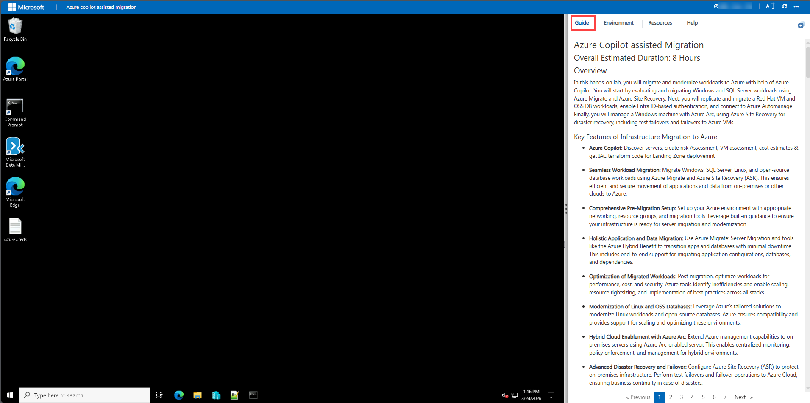

## 가상 머신 및 실습 가이드

가상 머신은 워크숍 전반에서 사용하는 주요 작업 환경입니다. 실습 가이드는 성공적인 수행을 위한 로드맵입니다.

## 실습 리소스 탐색

실습 리소스 및 자격 증명을 자세히 확인하려면 **Environment Details** 탭으로 이동하십시오.

   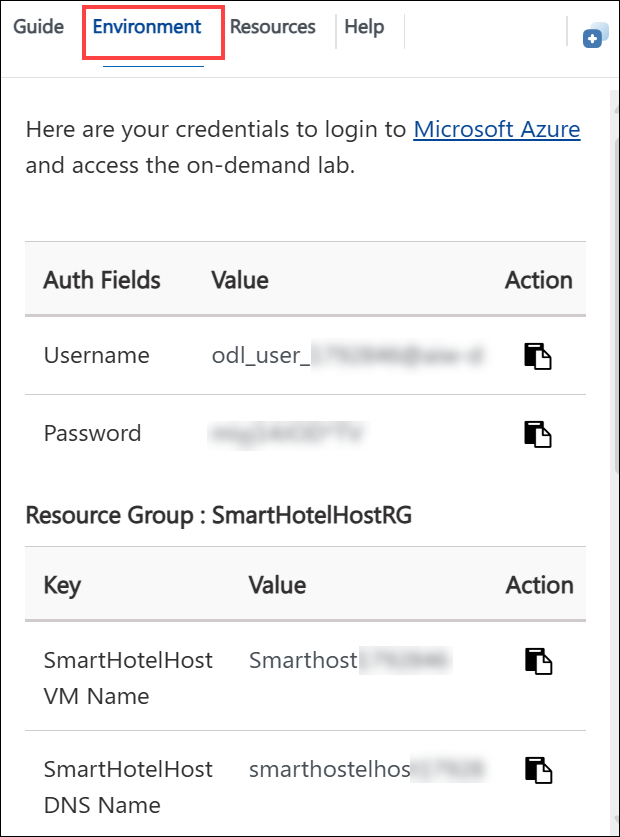

## 분할 창 기능 활용

편의를 위해 오른쪽 상단의 **Split Window** 버튼을 선택하여 실습 가이드를 별도의 창에서 열 수 있습니다.

   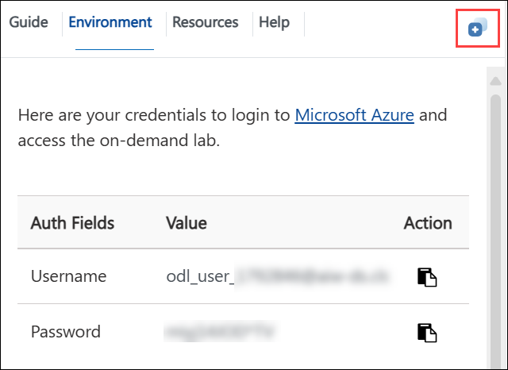

## 가상 머신 관리

필요에 따라 **Resources (1)** 탭에서 가상 머신을 자유롭게 **Start, Stop 또는 Restart (2)** 하실 수 있습니다. 실습 환경은 여러분의 것입니다!

  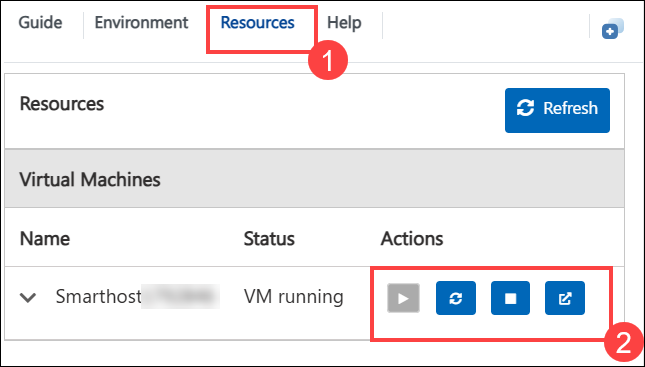

## 실습 가이드 확대/축소

환경 페이지의 확대/축소 수준을 조정하려면 실습 환경의 타이머 옆에 있는 **A↕ : 100%** 아이콘을 클릭하십시오.

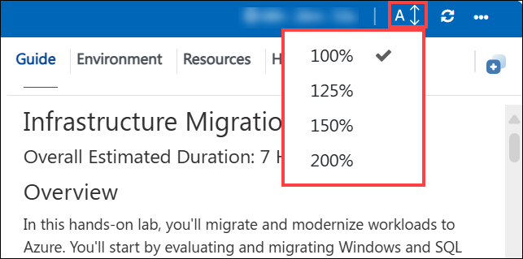 

## **Azure Portal 시작하기**

1. 가상 머신에서 아래와 같이 **Azure Portal** 아이콘을 클릭하십시오:

    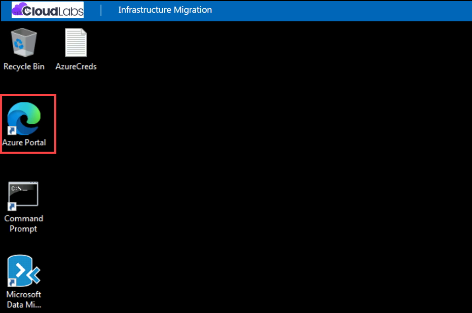

2. **Sign into Microsoft Azure** 탭이 표시됩니다. 여기에 자격 증명을 입력하십시오:

   - **Email/Username:** <inject key="AzureAdUserEmail"></inject>

      

3. 다음으로, 비밀번호를 입력하십시오:

   - **Password:** <inject key="AzureAdUserPassword"></inject>

      

4. **Stay Signed in?** 팝업이 표시되면 **No**를 클릭하십시오.

   

5. **Welcome to Microsoft Azure** 팝업 창이 나타나면 **Cancel**을 클릭하여 둘러보기를 건너뛰십시오.

     

6. **Azure Portal** 대시보드의 Navigate 섹션에서 **Resource groups**를 클릭하여 모든 리소스 그룹을 확인하십시오.

   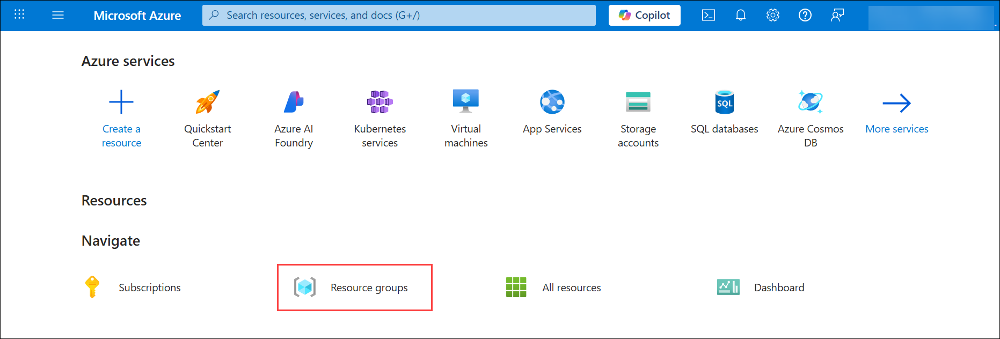
   
7. Azure Portal의 **Resource groups** 페이지에서 아래와 같이 모든 리소스 그룹이 있는지 확인하십시오.

   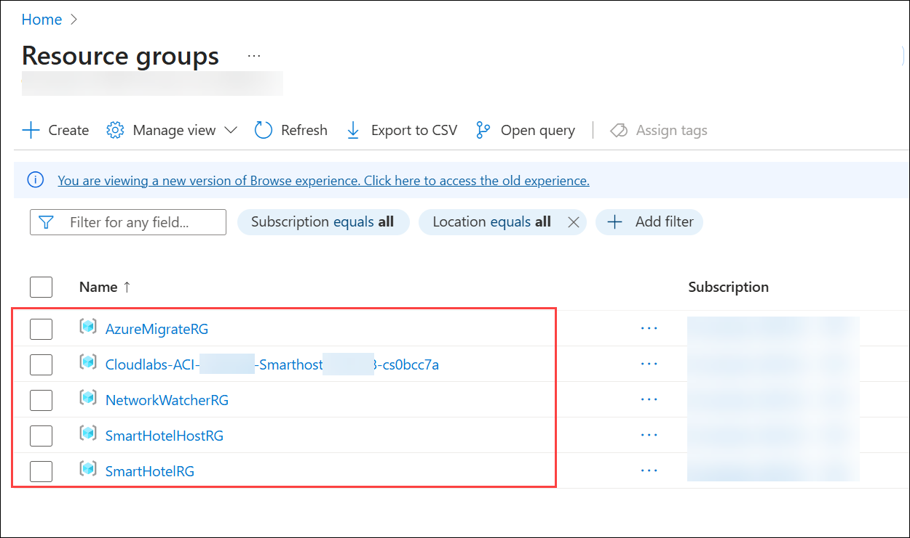

## **GitHub Portal 시작하기**

1. 브라우저에서 새 탭을 열고 아래 URL을 복사하여 브라우저 주소창에 붙여넣어 **GitHub 로그인** 페이지를 여십시오:

   ```
   https://github.com/login
   ```

2. **Sign in to GitHub** 탭에서 제공된 **GitHub username** **(1)**을 입력 필드에 입력하고, **Sign in with your identity provider**를 클릭하여 계속 진행하십시오 **(2)**.

    - **Username:** <inject key="GitHub User Name" enableCopy="true"/>

      

3. **Single sign-on to CloudLabs Organizations** 페이지에서 **Continue**를 클릭하여 진행하십시오.

    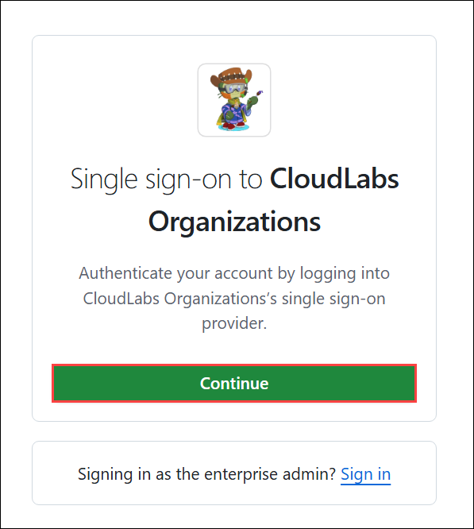

4. **Sign in** 탭이 표시됩니다. 여기에 다음 이메일/사용자 이름을 입력하고 **Next (2)**를 클릭하십시오:

   - **Email/Username: (1)** <inject key="AzureAdUserEmail"></inject>

       

5. 다음으로, 비밀번호를 입력하고 **Sign in (2)**을 클릭하십시오.

   - **Temporary Access Pass: (1)** <inject key="AzureAdUserPassword"></inject>

     
    
6. **Permission requested by** 팝업에서 **Accept**를 클릭하십시오.

      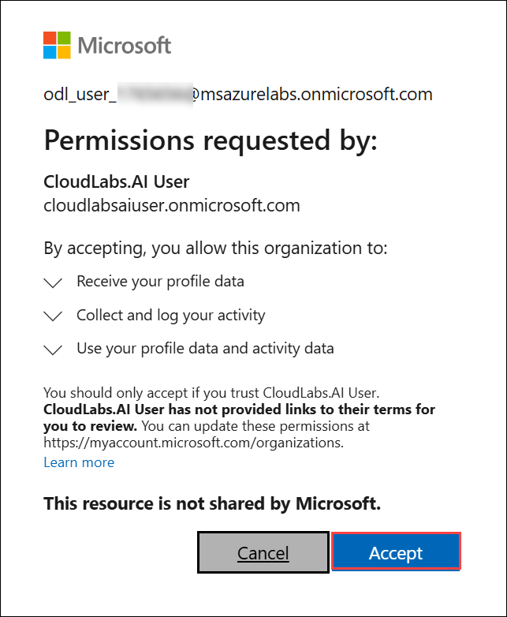

7. **Stay Signed in?** 팝업에서 **No**를 클릭하십시오.

    

8. 이제 **GitHub**에 성공적으로 로그인되었으며 **GitHub 홈페이지**로 리디렉션되었습니다.

    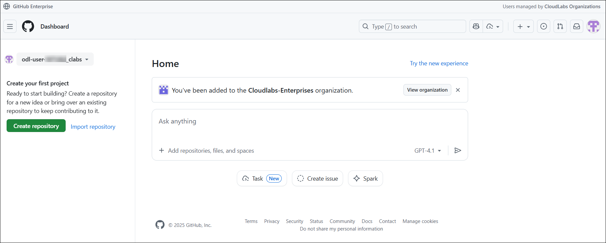


## 지원 연락처

CloudLabs 지원팀은 이메일과 실시간 채팅을 통해 연중무휴 24시간 지원을 제공하여 언제든지 원활한 도움을 받으실 수 있습니다. 학습자와 강사 모두를 위해 맞춤형 지원 채널을 제공하여 모든 요구 사항을 신속하고 효율적으로 처리합니다.

학습자 지원 연락처:

- Email 지원: cloudlabs-support@spektrasystems.com
- 실시간 채팅 지원: https://cloudlabs.ai/labs-support

이제 오른쪽 하단의 **Next**를 클릭하여 다음 페이지로 이동하십시오.


## 즐거운 학습 되십시오!!
